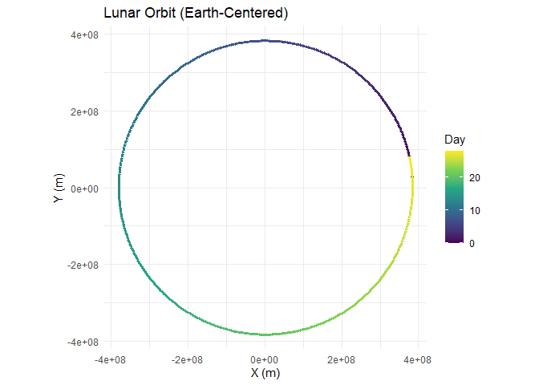
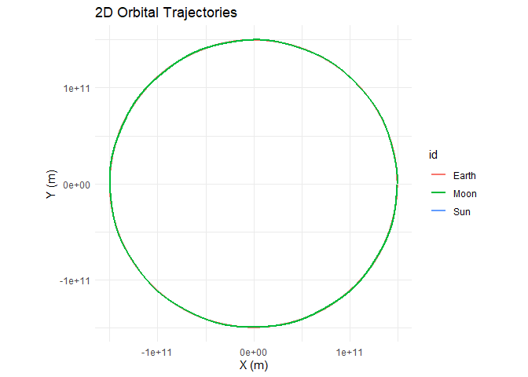
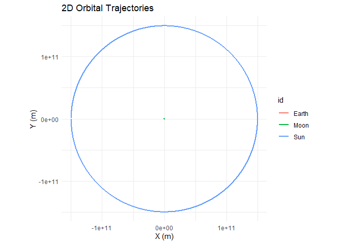
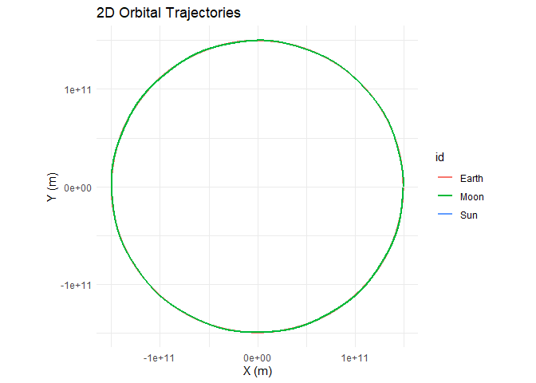
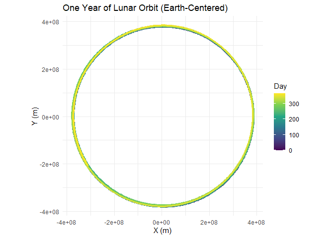
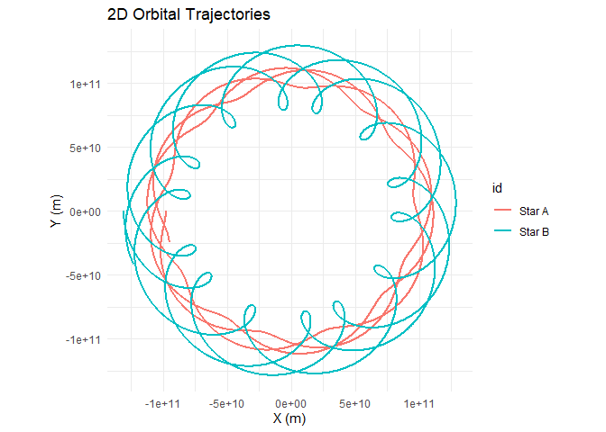

# orbitr

**Tidy N-Body Orbital Mechanics for R**

## Table of Contents

- [Quick Start](#quick-start)
- [API Reference](#api-reference)
- [3D Plotting](#3d-plotting)
- [Custom Visualization with
  ggplot2](#custom-visualization-with-ggplot2)
- [Custom Visualization with plotly](#custom-visualization-with-plotly)
- [Examples](#examples)
- [Built-In Physical Constants](#built-in-physical-constants)
- [The Physics](#the-physics)
- [The C++ Engine](#the-c-engine)
- [Reference Frames](#reference-frames)
- [Unstable Orbits and the Three-Body
  Problem](#unstable-orbits-and-the-three-body-problem)
- [License](#license)

## Quick Start

> **Note:** `orbitr` is a work in progress. The physics engine is
> functional, but the built-in plotting functions (`plot_orbits()` and
> `plot_orbits_3d()`) are intentionally minimal — they exist to get you
> a quick look at your simulation, not to produce publication-quality
> figures. Since `simulate_system()` returns a standard tidy tibble, you
> have the full power of `ggplot2`, `plotly`, and any other
> visualization library at your disposal. See [Custom Visualization with
> ggplot2](#custom-visualization-with-ggplot2) and [Custom Visualization
> with plotly](#custom-visualization-with-plotly) for examples.

`orbitr` is a lightweight N-body gravitational physics engine built for
the R ecosystem. Simulate planetary orbits, binary star systems, or
chaotic three-body problems in a few lines of pipe-friendly code. Under
the hood it ships a compiled C++ acceleration engine via `Rcpp` and
falls back gracefully to a fully vectorized pure-R implementation.

``` r
# install.packages("devtools")
devtools::install_github("daverosenman/orbitr")
```

``` r
library(orbitr)

sim <- create_system() |>
  add_body("Sun",   mass = mass_sun) |>
  add_body("Earth", mass = mass_earth, x = distance_earth_sun, vy = speed_earth) |>
  simulate_system(time_step = 86400, duration = 86400 * 365)

sim
```

    ## # A tibble: 732 × 9
    ##    id       mass       x       y     z          vx            vy    vz   time
    ##    <chr>   <dbl>   <dbl>   <dbl> <dbl>       <dbl>         <dbl> <dbl>  <dbl>
    ##  1 Sun   1.99e30 0       0           0     0           0             0      0
    ##  2 Earth 5.97e24 1.50e11 0           0     0       29780             0      0
    ##  3 Sun   1.99e30 6.65e 1 0           0     0.00154     0.0000132     0  86400
    ##  4 Earth 5.97e24 1.50e11 2.57e 9     0  -512.      29776.            0  86400
    ##  5 Sun   1.99e30 2.66e 2 2.29e 0     0     0.00308     0.0000529     0 172800
    ##  6 Earth 5.97e24 1.50e11 5.15e 9     0 -1025.      29762.            0 172800
    ##  7 Sun   1.99e30 5.98e 2 9.15e 0     0     0.00461     0.000119      0 259200
    ##  8 Earth 5.97e24 1.49e11 7.72e 9     0 -1537.      29740.            0 259200
    ##  9 Sun   1.99e30 1.06e 3 2.29e 1     0     0.00615     0.000212      0 345600
    ## 10 Earth 5.97e24 1.49e11 1.03e10     0 -2048.      29710.            0 345600
    ## # ℹ 722 more rows

`mass_sun`, `mass_earth`, `distance_earth_sun`, and `speed_earth` are
built-in constants — real-world values in SI units (kg, meters, m/s) so
you don’t have to look anything up. `orbitr` ships constants for the
Sun, all eight planets, and the Moon. See [Built-In Physical
Constants](#built-in-physical-constants) for the full list.

`simulate_system()` returns a tidy tibble — one row per body per time
step — ready for `dplyr`, `ggplot2`, `plotly`, or any other tool in the
R ecosystem.

``` r
sim |> plot_orbits()
```

<!-- -->

You’ll notice only Earth’s orbit is visible — the Sun is missing. That’s
a limitation of `plot_orbits()`: it draws trajectories using
`geom_path()`, and the Sun barely moves during the simulation so its
path is too small to see at this scale. The Sun *does* move — Newton’s
third law means Earth pulls on the Sun just as the Sun pulls on Earth,
causing it to trace a tiny loop around the system’s barycenter. It’s
just invisible at this zoom level because the Sun is ~330,000 times more
massive than the Earth. This stellar wobble is real, though — it’s
exactly the method astronomers use to detect exoplanets.

For better 2D plots where you control point markers, axis ranges, and
labels, use `ggplot2` directly on the simulation tibble (see [Custom
Visualization with ggplot2](#custom-visualization-with-ggplot2)). For
interactive 3D views where you can zoom in and find the Sun, see [3D
Plotting](#3d-plotting).

------------------------------------------------------------------------

## API Reference

### `create_system()`

Initializes an empty orbital simulation. The gravitational constant `G`
is set here and applies to all bodies added later. Set `G = 0` for a
zero-gravity (inertia-only) environment.

``` r
# Standard gravity (G = 6.6743e-11)
universe <- create_system()

# Stronger gravity (10x)
universe <- create_system(G = 6.6743e-10)

# Zero gravity sandbox
universe <- create_system(G = 0)
```

Returns an `orbit_system` S3 object.

------------------------------------------------------------------------

### `add_body(system, id, mass, x, y, z, vx, vy, vz)`

Adds a celestial body to the system. Position (`x`, `y`, `z`) is in
meters, velocity (`vx`, `vy`, `vz`) in meters per second. All default to
0, placing the body at the origin at rest.

| Parameter | Type | Default | Description |
|----|----|----|----|
| `system` | `orbit_system` | — | The system to add the body to |
| `id` | `character` | — | Unique name for the body |
| `mass` | `numeric` | — | Mass in kilograms (must be non-negative) |
| `x, y, z` | `numeric` | `0` | Initial position in meters |
| `vx, vy, vz` | `numeric` | `0` | Initial velocity in m/s |

``` r
create_system() |>
  add_body("Earth", mass = 5.97e24) |>
  add_body("Moon", mass = 7.34e22, x = 3.84e8, vy = 1022)
```

Piping-friendly: returns the updated `orbit_system`.

------------------------------------------------------------------------

### `simulate_system(system, time_step, duration, method, softening, use_cpp)`

The core engine. Propagates the system forward through time and returns
the full trajectory as a tidy tibble.

| Parameter | Type | Default | Description |
|----|----|----|----|
| `system` | `orbit_system` | — | The configured system |
| `time_step` | `numeric` | `60` | Seconds per integration step |
| `duration` | `numeric` | `86400` | Total simulation time in seconds |
| `method` | `character` | `"verlet"` | `"verlet"`, `"euler_cromer"`, or `"euler"` |
| `softening` | `numeric` | `0` | Softening length in meters |
| `use_cpp` | `logical` | `TRUE` | Use the C++ engine when available |

Returns a tibble with columns: `time`, `id`, `mass`, `x`, `y`, `z`,
`vx`, `vy`, `vz`.

------------------------------------------------------------------------

### `shift_reference_frame(sim_data, center_id, keep_center = TRUE)`

Transforms all positions and velocities so that a chosen body sits at
the origin for every time step. This is how you go from a heliocentric
view to a geocentric one, for example.

| Parameter     | Type        | Default | Description                          |
|---------------|-------------|---------|--------------------------------------|
| `sim_data`    | `tibble`    | —       | Output from `simulate_system()`      |
| `center_id`   | `character` | —       | ID of the body to place at (0, 0, 0) |
| `keep_center` | `logical`   | `TRUE`  | Keep the center body in the output?  |

``` r
# View the Moon's orbit from Earth's perspective
sim |>
  shift_reference_frame("Earth") |>
  plot_orbits()

# Remove Earth from the plot entirely
sim |>
  shift_reference_frame("Earth", keep_center = FALSE) |>
  plot_orbits()
```

------------------------------------------------------------------------

### `plot_orbits(sim_data, three_d = FALSE)`

A smart plotting dispatcher that automatically chooses between 2D and 3D
visualization. If any body has non-zero Z positions (or if
`three_d = TRUE`), it renders an interactive 3D plot using `plotly`.
Otherwise it produces a 2D trajectory map (x vs y) using `ggplot2` with
`coord_equal()`.

| Parameter  | Type      | Default | Description                             |
|------------|-----------|---------|-----------------------------------------|
| `sim_data` | `tibble`  | —       | Output from `simulate_system()`         |
| `three_d`  | `logical` | `FALSE` | Force 3D rendering even for planar data |

Returns a `ggplot` object (2D) or a `plotly` HTML widget (3D).

### `plot_orbits_3d(sim_data)`

Generates an interactive 3D visualization using `plotly`. You can click
and drag to rotate, scroll to zoom, and hover over trajectories to see
body names and timestamps. Uses `aspectmode = "data"` to preserve
proportions so circular orbits look circular in 3D space.

Requires the `plotly` package. Returns a `plotly` HTML widget.

------------------------------------------------------------------------

## 3D Plotting

All simulations in `orbitr` run in full 3D — every body always has `x`,
`y`, and `z` coordinates. When all motion happens in the XY plane (i.e.,
`z = 0` and `vz = 0` for every body), `plot_orbits()` produces a static
2D `ggplot2` chart. The moment any body has non-zero Z motion,
`plot_orbits()` automatically switches to an interactive 3D `plotly`
visualization — no code changes needed.

You can also force 3D rendering for planar data with `three_d = TRUE`,
which can be useful if you want the interactive rotation and zoom
capabilities even for a flat system.

### A Tilted Lunar Orbit

The Moon’s real orbit is inclined about 5° to the ecliptic. You can
approximate this by giving the Moon a small `vz` component:

``` r
create_system() |>
  add_body("Earth", mass = mass_earth) |>
  add_body("Moon",  mass = mass_moon,
           x = distance_earth_moon,
           vy = speed_moon * cos(5 * pi / 180),
           vz = speed_moon * sin(5 * pi / 180)) |>
  simulate_system(time_step = 3600, duration = 86400 * 28) |>
  plot_orbits()
```

<!-- -->

Because `vz` is non-zero, `plot_orbits()` detects 3D motion and returns
an interactive plotly widget. You can drag to rotate, scroll to zoom,
and hover to see timestamps.

------------------------------------------------------------------------

## Custom Visualization with ggplot2

`plot_orbits()` and `plot_orbits_3d()` are convenience functions for
quick trajectory plots — they’re designed to get you a useful
visualization in one line so you can focus on setting up the physics.
But the real power of `orbitr` is that `simulate_system()` returns a
standard tidy tibble. You can use `ggplot2`, `plotly`, or any other
visualization tool directly on the output.

Here’s what the raw output looks like:

``` r
sim <- create_system() |>
  add_body("Earth", mass = mass_earth) |>
  add_body("Moon",  mass = mass_moon, x = distance_earth_moon, vy = speed_moon) |>
  simulate_system(time_step = 3600, duration = 86400 * 28)

sim
```

    ## # A tibble: 1,346 × 9
    ##    id       mass          x           y     z      vx          vy    vz  time
    ##    <chr>   <dbl>      <dbl>       <dbl> <dbl>   <dbl>       <dbl> <dbl> <dbl>
    ##  1 Earth 5.97e24         0         0        0   0        0            0     0
    ##  2 Moon  7.34e22 384400000         0        0   0     1022            0     0
    ##  3 Earth 5.97e24       215.        0        0   0.119    0.000571     0  3600
    ##  4 Moon  7.34e22 384382520.  3679200        0  -9.71  1022.           0  3600
    ##  5 Earth 5.97e24       860.        4.11     0   0.239    0.00229      0  7200
    ##  6 Moon  7.34e22 384330083.  7358065.       0 -19.4   1022.           0  7200
    ##  7 Earth 5.97e24      1934.       16.5      0   0.358    0.00514      0 10800
    ##  8 Moon  7.34e22 384242692. 11036262.       0 -29.1   1022.           0 10800
    ##  9 Earth 5.97e24      3438.       41.1      0   0.477    0.00914      0 14400
    ## 10 Moon  7.34e22 384120357. 14713454.       0 -38.8   1021.           0 14400
    ## # ℹ 1,336 more rows

Each row is one body at one point in time. Every column is available for
plotting, filtering, or analysis. Since this is just a tibble, you have
the full power of `dplyr` and `ggplot2` at your disposal.

For example, in the Earth-Moon system, `plot_orbits()` shows overlapping
circles because both bodies orbit their shared barycenter at roughly the
same scale. A more useful visualization might plot each body’s distance
from the barycenter over time:

``` r
library(ggplot2)

sim |>
  dplyr::mutate(r = sqrt(x^2 + y^2)) |>
  ggplot(aes(x = time / 86400, y = r, color = id)) +
  geom_line(linewidth = 1) +
  labs(
    title = "Distance from Barycenter Over Time",
    x = "Time (days)",
    y = "Distance (m)",
    color = "Body"
  ) +
  theme_minimal()
```

<!-- -->

Or plot the Moon’s path relative to Earth with a color gradient showing
the passage of time:

``` r
sim |>
  shift_reference_frame("Earth", keep_center = FALSE) |>
  ggplot(aes(x = x, y = y, color = time / 86400)) +
  geom_path(linewidth = 1.2) +
  scale_color_viridis_c(name = "Day") +
  coord_equal() +
  labs(title = "Lunar Orbit (Earth-Centered)", x = "X (m)", y = "Y (m)") +
  theme_minimal()
```

<!-- -->

------------------------------------------------------------------------

## Custom Visualization with plotly

Just as `plot_orbits()` is a quick convenience for 2D work,
`plot_orbits_3d()` is a quick convenience for 3D. Both are intentionally
simple — they get you a useful plot in one line so you can focus on the
physics, not the formatting. When you need more control, the simulation
tibble works just as well with `plotly` as it does with `ggplot2`.

For example, you could color trajectories by speed rather than by body,
and add markers at the start and end of each orbit:

``` r
library(plotly)
```

    ## Warning: package 'plotly' was built under R version 4.5.3

    ## 
    ## Attaching package: 'plotly'

    ## The following object is masked from 'package:ggplot2':
    ## 
    ##     last_plot

    ## The following object is masked from 'package:stats':
    ## 
    ##     filter

    ## The following object is masked from 'package:graphics':
    ## 
    ##     layout

``` r
sim <- create_system() |>
  add_body("Earth", mass = mass_earth) |>
  add_body("Moon",  mass = mass_moon,
           x = distance_earth_moon,
           vy = speed_moon * cos(5 * pi / 180),
           vz = speed_moon * sin(5 * pi / 180)) |>
  simulate_system(time_step = 3600, duration = 86400 * 28)

sim <- sim |>
  dplyr::mutate(speed = sqrt(vx^2 + vy^2 + vz^2))

plot_ly() |>
  add_trace(
    data = dplyr::filter(sim, id == "Moon"),
    x = ~x, y = ~y, z = ~z,
    type = 'scatter3d', mode = 'lines',
    line = list(
      width = 5,
      color = ~speed,
      colorscale = 'Viridis',
      showscale = TRUE,
      colorbar = list(title = "Speed (m/s)")
    ),
    name = "Moon"
  ) |>
  add_trace(
    data = dplyr::filter(sim, id == "Earth"),
    x = ~x, y = ~y, z = ~z,
    type = 'scatter3d', mode = 'lines',
    line = list(width = 3, color = 'gray'),
    name = "Earth"
  ) |>
  layout(
    title = "Lunar Orbit Around Earth",
    showlegend = FALSE,
    scene = list(
      xaxis = list(title = 'X (m)'),
      yaxis = list(title = 'Y (m)'),
      zaxis = list(title = 'Z (m)'),
      aspectmode = "data"
    )
  )
```

<!-- -->

The point is the same as with `ggplot2`: `simulate_system()` returns a
standard tibble, so you have full access to `plotly`’s API for anything
the built-in plotting functions don’t cover.

------------------------------------------------------------------------

## Examples

### The Earth-Moon System

A standard 28-day lunar orbit. One-hour time steps.

``` r
library(orbitr)

create_system() |>
  add_body("Earth", mass = mass_earth) |>
  add_body("Moon",  mass = mass_moon, x = distance_earth_moon, vy = speed_moon) |>
  simulate_system(time_step = 3600, duration = 86400 * 28) |>
  plot_orbits()
```

<!-- -->

### The Sun-Earth System

A full year with daily time steps.

``` r
create_system() |>
  add_body("Sun",   mass = mass_sun) |>
  add_body("Earth", mass = mass_earth, x = distance_earth_sun, vy = speed_earth) |>
  simulate_system(time_step = 86400, duration = 86400 * 365) |>
  plot_orbits()
```

<!-- -->

### The Three-Body Problem (Sun-Earth-Moon)

Because `orbitr` uses N-body gravity, nested hierarchies require no
special setup. Piggyback the Moon’s initial conditions onto Earth’s
using simple vector addition. Note that at this scale, the Earth and
Moon orbits overlap — the Earth-Moon distance (~384,000 km) is tiny
compared to the Earth-Sun distance (~150 million km). Use
`shift_reference_frame("Earth")` (shown in the next example) to zoom
into the Earth-Moon subsystem:

``` r
create_system() |>
  add_body("Sun",   mass = mass_sun) |>
  add_body("Earth", mass = mass_earth, x = distance_earth_sun, vy = speed_earth) |>
  add_body("Moon",  mass = mass_moon,
           x = distance_earth_sun + distance_earth_moon,   # Earth's X + lunar orbital radius
           vy = speed_earth + speed_moon) |>               # Earth's speed + Moon's orbital speed
  simulate_system(time_step = 3600, duration = 86400 * 365) |>
  plot_orbits()
```

<!-- -->

### Shifting Your Point of View

The three-body plot above is heliocentric (Sun at center). To see the
Moon’s path *from Earth’s perspective*, pipe the results through
`shift_reference_frame()`:

``` r
create_system() |>
  add_body("Sun",   mass = mass_sun) |>
  add_body("Earth", mass = mass_earth, x = distance_earth_sun, vy = speed_earth) |>
  add_body("Moon",  mass = mass_moon,
           x = distance_earth_sun + distance_earth_moon,
           vy = speed_earth + speed_moon) |>
  simulate_system(time_step = 3600, duration = 86400 * 365) |>
  shift_reference_frame("Earth") |>
  plot_orbits()
```

<!-- -->

### Comparing Integration Methods

Use the `method` argument to see how different integrators behave over
long simulations:

``` r
library(dplyr)
```

    ## 
    ## Attaching package: 'dplyr'

    ## The following objects are masked from 'package:stats':
    ## 
    ##     filter, lag

    ## The following objects are masked from 'package:base':
    ## 
    ##     intersect, setdiff, setequal, union

``` r
system <- create_system() |>
  add_body("Star", mass = 1e30) |>
  add_body("Planet", mass = 1e24, x = 1e11, vy = 30000)

verlet <- simulate_system(system, time_step = 3600, duration = 86400 * 365, method = "verlet") |>
  mutate(method = "Velocity Verlet")

euler_cromer <- simulate_system(system, time_step = 3600, duration = 86400 * 365, method = "euler_cromer") |>
  mutate(method = "Euler-Cromer")

euler <- simulate_system(system, time_step = 3600, duration = 86400 * 365, method = "euler") |>
  mutate(method = "Standard Euler")

bind_rows(verlet, euler_cromer, euler) |>
  filter(id == "Planet") |>
  ggplot2::ggplot(ggplot2::aes(x = x, y = y, color = method)) +
  ggplot2::geom_path(alpha = 0.7) +
  ggplot2::coord_equal() +
  ggplot2::theme_minimal()
```

<!-- -->

You’ll see that Verlet traces a clean closed ellipse, Euler-Cromer stays
close but drifts slightly, and standard Euler spirals outward as it
pumps energy into the orbit.

### The Kepler-16 System: A Real Circumbinary Planet

Kepler-16b was the first confirmed planet orbiting two stars — a
real-life Tatooine. The system has a K-type star (0.68 solar masses) and
an M-type star (0.20 solar masses) orbiting each other every ~41 days,
with a Saturn-sized planet orbiting the pair at about 0.7 AU.

``` r
G <- 6.6743e-11
AU <- distance_earth_sun

# Star masses
m_A <- 0.68 * mass_sun
m_B <- 0.20 * mass_sun
m_planet <- 0.333 * mass_jupiter

# Binary star orbit (~0.22 AU separation)
a_bin <- 0.22 * AU
r_A <- a_bin * m_B / (m_A + m_B)
r_B <- a_bin * m_A / (m_A + m_B)
v_A <- sqrt(G * m_B^2 / ((m_A + m_B) * a_bin))
v_B <- sqrt(G * m_A^2 / ((m_A + m_B) * a_bin))

# Planet orbit (0.7048 AU from barycenter)
r_planet <- 0.7048 * AU
v_planet <- sqrt(G * (m_A + m_B) / r_planet)

create_system() |>
  add_body("Star A", mass = m_A, x = r_A, vy = v_A) |>
  add_body("Star B", mass = m_B, x = -r_B, vy = -v_B) |>
  add_body("Kepler-16b", mass = m_planet, x = r_planet, vy = v_planet) |>
  simulate_system(time_step = 3600, duration = 86400 * 228.8 * 3) |>
  plot_orbits()
```

<!-- -->

------------------------------------------------------------------------

## Built-In Physical Constants

`orbitr` ships a set of real-world masses, distances, and orbital speeds
so you don’t have to Google them every time. All values are in SI units
(kg, meters, m/s).

``` r
library(orbitr)

# Masses
mass_sun          # 1.989e30 kg
mass_earth        # 5.972e24 kg
mass_moon         # 7.342e22 kg
mass_mars         # 6.417e23 kg
mass_jupiter      # 1.898e27 kg
mass_saturn       # 5.683e26 kg
mass_venus        # 4.867e24 kg
mass_mercury      # 3.301e23 kg

# Orbital distances (semi-major axes)
distance_earth_sun    # 1.496e11 m  (~149.6 million km)
distance_earth_moon   # 3.844e8  m  (~384,400 km)
distance_mars_sun     # 2.279e11 m
distance_jupiter_sun  # 7.785e11 m
distance_venus_sun    # 1.082e11 m
distance_mercury_sun  # 5.791e10 m

# Mean orbital speeds
speed_earth       # 29,780 m/s
speed_moon        #  1,022 m/s
speed_mars        # 24,070 m/s
speed_jupiter     # 13,060 m/s
speed_venus       # 35,020 m/s
speed_mercury     # 47,360 m/s
```

This means the Earth-Moon example can be written as:

``` r
create_system() |>
  add_body("Earth", mass = mass_earth) |>
  add_body("Moon",  mass = mass_moon, x = distance_earth_moon, vy = speed_moon) |>
  simulate_system(time_step = 3600, duration = 86400 * 28) |>
  plot_orbits()
```

### Why “Distance” Constants Are Semi-Major Axes

Orbital distances are not truly constant — every orbit is an ellipse, so
the separation between two bodies changes continuously throughout each
revolution. The values provided here are **semi-major axes**: the
average of the closest approach (periapsis) and the farthest point
(apoapsis).

The semi-major axis is the single most characteristic length scale of an
elliptical orbit. It determines the orbital period via Kepler’s Third
Law, and when paired with the mean orbital speed, it produces a
near-circular trajectory that closely approximates the real orbit. For
example, the Earth-Sun distance varies from about 147.1 million km in
January (perihelion) to 152.1 million km in July (aphelion). The
semi-major axis of 149.6 million km sits right in the middle and gives
the correct one-year orbital period.

If you want an elliptical orbit instead, start the body at periapsis
with a faster-than-mean velocity, or at apoapsis with a slower one.

------------------------------------------------------------------------

## The Physics

### Gravitational Acceleration

Every body in the system attracts every other body according to Newton’s
Law of Universal Gravitation. For body $j$, the net acceleration due to
all other bodies $k$ is:

$$
\vec{a}_j = \sum_{k \neq j} \frac{G \, m_k}{r_{jk}^2} \, \hat{r}_{jk}
$$

where $r_{jk} = \lvert\vec{r}_k - \vec{r}_j\rvert$ is the distance
between the two bodies and $\hat{r}_{jk}$ is the unit vector pointing
from $j$ toward $k$.

### Why Initial Velocity Matters

Gravity alone will pull every body straight toward every other body.
What *prevents* them from colliding is their initial velocity — the
sideways motion that turns a free-fall into a curved orbit. This is the
same reason the Moon doesn’t crash into the Earth: it’s falling toward
us constantly, but it’s also moving sideways fast enough that it keeps
missing.

When you call `add_body()`, the `vx`, `vy`, `vz` parameters set this
initial velocity. The balance between speed and distance determines the
shape of the orbit. At a given distance $r$ from a central mass $M$, the
**circular orbit velocity** is:

$$
v_{\text{circ}} = \sqrt{\frac{G \, M}{r}}
$$

If the body’s speed exactly matches this, it traces a perfect circle.
Faster and the orbit stretches into an ellipse (or escapes entirely if
$v \geq v_{\text{circ}} \sqrt{2}$). Slower and the orbit drops into a
tighter ellipse that dips closer to the central body. With zero
velocity, the body falls straight in — no orbit at all.

### Gravitational Softening

When two bodies pass very close, $r \to 0$ and the acceleration diverges
toward infinity. This is a well-known numerical problem in N-body codes.
`orbitr` offers an optional **softening length** $\varepsilon$ that
regularizes the potential:

$$
r_{\text{soft}} = \sqrt{r^2 + \varepsilon^2}
$$

With softening enabled, close encounters produce large but finite forces
instead of blowing up to `NaN`. Set `softening = 0` (the default) for
exact Newtonian gravity, or try something like `softening = 1e4` (10 km)
for dense systems.

### Numerical Integration Methods

`simulate_system()` offers three methods for stepping the system forward
through time. All operate in 3D Cartesian coordinates.

#### 1. Velocity Verlet (default, `method = "verlet"`)

A second-order symplectic integrator. It conserves energy over long
timescales, making it the gold standard for orbital mechanics. Orbits
stay closed and stable indefinitely.

$$
\vec{x}_{t+\Delta t} = \vec{x}_t + \vec{v}_t \, \Delta t + \tfrac{1}{2} \vec{a}_t \, \Delta t^2
$$

$$
\vec{v}_{t+\Delta t} = \vec{v}_t + \tfrac{1}{2} \left( \vec{a}_t + \vec{a}_{t+\Delta t} \right) \Delta t
$$

The position is advanced first, then the acceleration is recalculated at
the new position, and finally the velocity is updated using the average
of the old and new accelerations. This requires **two** acceleration
evaluations per step (the main cost), but the payoff in stability is
enormous.

#### 2. Euler-Cromer (`method = "euler_cromer"`)

A first-order symplectic method. It updates velocity first, then uses
the *new* velocity to update position. This small reordering prevents
the systematic energy drift that plagues standard Euler:

$$
\vec{v}_{t+\Delta t} = \vec{v}_t + \vec{a}_t \, \Delta t
$$

$$
\vec{x}_{t+\Delta t} = \vec{x}_t + \vec{v}_{t+\Delta t} \, \Delta t
$$

Faster than Verlet (one acceleration evaluation per step) but less
accurate. Good for quick previews.

#### 3. Standard Euler (`method = "euler"`)

The classical textbook method. Position and velocity are both updated
using values from the *current* time step:

$$
\vec{x}_{t+\Delta t} = \vec{x}_t + \vec{v}_t \, \Delta t
$$

$$
\vec{v}_{t+\Delta t} = \vec{v}_t + \vec{a}_t \, \Delta t
$$

This artificially pumps energy into the system, causing orbits to spiral
outward over time. Included primarily for educational comparison — use
Verlet for real work.

------------------------------------------------------------------------

## The C++ Engine

The inner acceleration loop is the computational bottleneck of any
N-body simulation. `orbitr` ships a compiled C++ kernel (via `Rcpp`)
that computes the $O(n^2)$ pairwise interactions in a tight nested loop.
When the package is installed from source with a working C++ toolchain,
`simulate_system()` automatically dispatches to this engine. If the
compiled code isn’t available, it falls back to a vectorized R
implementation that uses matrix outer products — still fast, but the C++
path is significantly faster for systems with many bodies.

You can control this with the `use_cpp` argument:

``` r
# Force the pure-R engine (useful for debugging or benchmarking)
simulate_system(system, use_cpp = FALSE)
```

------------------------------------------------------------------------

## Reference Frames

Every N-body simulation has to pick an origin — some point that sits at
(0, 0, 0). By default, `orbitr` uses the coordinate system you set up:
whatever body you placed at the origin stays there (at least initially),
and everything else is measured relative to that point. This is your
**reference frame**.

The trouble is that the “natural” reference frame for setting up a
problem isn’t always the best one for understanding the results. A
Sun-centered (heliocentric) frame is the obvious choice for building a
solar system, but it’s useless for studying the Moon’s orbit — at the
Sun’s scale, the Earth-Moon distance is a rounding error and both
trajectories overlap into a single line.

`shift_reference_frame()` solves this by applying a **Galilean
coordinate transformation**: at every time step, it subtracts the
position and velocity of a chosen body from all other bodies. The math
is simple vector subtraction:

$$
\vec{r}'_i(t) = \vec{r}_i(t) - \vec{r}_{\text{center}}(t)
$$

$$
\vec{v}'_i(t) = \vec{v}_i(t) - \vec{v}_{\text{center}}(t)
$$

The chosen body ends up fixed at the origin, and every other body’s
trajectory shows its motion *relative to that body*. No physics changes
— same forces, same accelerations — you’re just moving the camera.

### Heliocentric to Geocentric

The most common use case. Build a Sun-Earth-Moon system in heliocentric
coordinates (the natural way), then shift to Earth’s perspective to see
the lunar orbit:

``` r
sim <- create_system() |>
  add_body("Sun",   mass = mass_sun) |>
  add_body("Earth", mass = mass_earth, x = distance_earth_sun, vy = speed_earth) |>
  add_body("Moon",  mass = mass_moon,
           x = distance_earth_sun + distance_earth_moon,
           vy = speed_earth + speed_moon) |>
  simulate_system(time_step = 3600, duration = 86400 * 365)

# Heliocentric view — Earth and Moon overlap at this scale,
# and the Sun barely moves so its trajectory is invisible
sim |> plot_orbits()
```

<!-- -->

``` r
# Geocentric view — now you can see the Moon's orbit clearly
sim |> shift_reference_frame("Earth") |> plot_orbits()
```

<!-- -->

### Removing the Center Body

When `keep_center = TRUE` (the default), the center body stays in the
output with all coordinates set to zero — it appears as a dot at the
origin. Set `keep_center = FALSE` to remove it entirely, which is useful
when you want to focus exclusively on the orbiting bodies or feed the
data into a custom visualization:

``` r
library(ggplot2)

sim |>
  shift_reference_frame("Earth", keep_center = FALSE) |>
  dplyr::filter(id == "Moon") |>
  ggplot(aes(x = x, y = y, color = time / 86400)) +
  geom_path(linewidth = 1.2) +
  scale_color_viridis_c(name = "Day") +
  coord_equal() +
  labs(title = "One Year of Lunar Orbit (Earth-Centered)",
       x = "X (m)", y = "Y (m)") +
  theme_minimal()
```

<!-- -->

### Viewing a Binary Star System from the Planet

Reference frame shifts work on any body in the system, not just the most
massive one. Here’s Kepler-16b’s view of its two parent stars:

``` r
G <- 6.6743e-11
AU <- distance_earth_sun

m_A <- 0.68 * mass_sun
m_B <- 0.20 * mass_sun
m_planet <- 0.333 * mass_jupiter

a_bin <- 0.22 * AU
r_A <- a_bin * m_B / (m_A + m_B)
r_B <- a_bin * m_A / (m_A + m_B)
v_A <- sqrt(G * m_B^2 / ((m_A + m_B) * a_bin))
v_B <- sqrt(G * m_A^2 / ((m_A + m_B) * a_bin))

r_planet <- 0.7048 * AU
v_planet <- sqrt(G * (m_A + m_B) / r_planet)

create_system() |>
  add_body("Star A", mass = m_A, x = r_A, vy = v_A) |>
  add_body("Star B", mass = m_B, x = -r_B, vy = -v_B) |>
  add_body("Kepler-16b", mass = m_planet, x = r_planet, vy = v_planet) |>
  simulate_system(time_step = 3600, duration = 86400 * 228.8 * 3) |>
  shift_reference_frame("Kepler-16b", keep_center = FALSE) |>
  plot_orbits()
```

<!-- -->

From the planet’s perspective, both stars trace looping spirograph-like
patterns across the sky — a double sunset that moves differently every
evening.

For a deeper exploration of reference frames including chaining shifts
and analyzing relative velocities, see the [Reference Frames
vignette](https://drosenman.github.io/orbitr/articles/reference-frames.html).

------------------------------------------------------------------------

## Unstable Orbits and the Three-Body Problem

If you start plugging in random masses and velocities, you’ll quickly
discover that most configurations are wildly unstable. This isn’t a bug
— it’s physics. Stable orbits are the exception, not the rule.

In a two-body system, stability is relatively easy to achieve: give the
smaller body the right velocity at the right distance and it traces a
clean ellipse forever. But the moment you add a third body, things get
chaotic. The three-body problem has no general closed-form solution —
small differences in initial conditions lead to dramatically different
outcomes, including bodies being flung out of the system entirely.

Here’s an example: three equal-mass stars arranged in a triangle with
slightly asymmetric velocities. It starts off looking like an
interesting dance, but the asymmetry compounds and eventually one or
more stars get ejected:

``` r
create_system() |>
  add_body("Star A", mass = 1e30, x = 1e11, y = 0, vx = 0, vy = 15000) |>
  add_body("Star B", mass = 1e30, x = -5e10, y = 8.66e10, vx = -12990, vy = -7500) |>
  add_body("Star C", mass = 1e30, x = -5e10, y = -8.66e10, vx = 14000, vy = -8000) |>
  simulate_system(time_step = 3600, duration = 86400 * 365 * 10) |>
  plot_orbits()
```

<!-- -->

This is actually what happens in real stellar dynamics — close
three-body encounters in star clusters frequently eject one star at high
velocity while the remaining two settle into a tighter binary. The
process is called gravitational slingshot ejection.

If your simulations are producing messy, diverging trajectories, here
are a few things to check before assuming something is wrong:

- **Velocity too high or too low.** At a given distance $r$ from a
  central mass $M$, the circular orbit speed is $v = \sqrt{GM/r}$.
  Deviating significantly from this produces eccentric orbits or escape
  trajectories.
- **Bodies too close together.** Close encounters produce extreme
  accelerations that can blow up numerically. Try increasing \`soften
