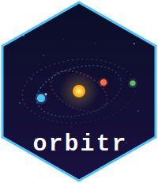

```{r, include = FALSE}
knitr::opts_chunk$set(
  fig.path = "man/figures/README-"
)
```

# orbitr 

**Tidy N-body orbital mechanics for R.**

> **Early beta** — `orbitr` is functional and the physics engine is stable, but this is an early release. Function names, defaults, and behavior may change between versions. Feedback, bug reports, and contributions are welcome on [GitHub](https://github.com/DRosenman/orbitr).

> Full documentation, examples, and guides at **[orbit-r.com](https://orbit-r.com/)**

## Installation

```r
# install.packages("devtools")
devtools::install_github("DRosenman/orbitr")
```

## Four Lines to an Orbit

```{r, message = FALSE}
library(orbitr)

sim <- create_system() |>
  add_body("Sun",   mass = mass_sun) |>
  add_body("Earth", mass = mass_earth, x = distance_earth_sun, vy = speed_earth) |>
  simulate_system(time_step = seconds_per_day, duration = seconds_per_year)

sim |> plot_orbits()
```

Built-in constants like `mass_sun`, `distance_earth_sun`, and `speed_earth` are real-world values in SI units — no Googling needed. `simulate_system()` returns a tidy tibble, ready for `dplyr`, `ggplot2`, `plotly`, or anything else.

### Animated

```{r earth-orbit-anim, message = FALSE, cache = TRUE}
animate_system(sim, fps = 15, duration = 5)
```

## More Examples

### Earth-Moon

```{r}
create_system() |>
  add_body("Earth", mass = mass_earth) |>
  add_body("Moon",  mass = mass_moon, x = distance_earth_moon, vy = speed_moon) |>
  simulate_system(time_step = seconds_per_hour, duration = seconds_per_day * 28) |>
  plot_orbits()
```

### Sun-Earth-Moon (from Earth's Perspective)

```{r}
create_system() |>
  add_body("Sun",   mass = mass_sun) |>
  add_body("Earth", mass = mass_earth, x = distance_earth_sun, vy = speed_earth) |>
  add_body("Moon",  mass = mass_moon,
           x = distance_earth_sun + distance_earth_moon,
           vy = speed_earth + speed_moon) |>
  simulate_system(time_step = seconds_per_hour, duration = seconds_per_year) |>
  shift_reference_frame("Earth") |>
  plot_orbits()
```

### Kepler-16: A Real Circumbinary Planet

Kepler-16b orbits two stars — a real-life Tatooine.

```{r}
G  <- gravitational_constant
AU <- distance_earth_sun

m_A <- 0.68 * mass_sun
m_B <- 0.20 * mass_sun
a_bin <- 0.22 * AU

r_A <- a_bin * m_B / (m_A + m_B)
r_B <- a_bin * m_A / (m_A + m_B)
v_A <- sqrt(G * m_B^2 / ((m_A + m_B) * a_bin))
v_B <- sqrt(G * m_A^2 / ((m_A + m_B) * a_bin))

r_planet <- 0.7048 * AU
v_planet <- sqrt(G * (m_A + m_B) / r_planet)

create_system() |>
  add_body("Star A",      mass = m_A,                 x = r_A,      vy = v_A) |>
  add_body("Star B",      mass = m_B,                 x = -r_B,     vy = -v_B) |>
  add_body("Kepler-16b",  mass = 0.333 * mass_jupiter, x = r_planet, vy = v_planet) |>
  simulate_system(time_step = seconds_per_hour, duration = seconds_per_day * 228.8 * 3) |>
  plot_orbits()
```

## Features

- **Tidy output** — one row per body per time step, works with the whole tidyverse
- **Built-in constants** — masses, distances, and speeds for the Sun, all eight planets, and the Moon
- **C++ engine** — compiled via Rcpp with automatic fallback to vectorized R
- **Three integrators** — Velocity Verlet (default), Euler-Cromer, and standard Euler
- **2D and 3D** — `plot_orbits()` auto-dispatches to interactive plotly when any body has Z-axis motion
- **Animations** — `animate_system()` renders GIFs with fading trails via gganimate
- **Reference frames** — `shift_reference_frame("Earth")` re-centers everything on any body

## Learn More

- **[Get Started](https://orbit-r.com/articles/quick-start.html)** — full walkthrough
- **[Building Two-Body Orbits](https://orbit-r.com/articles/building-two-body-orbits.html)** — choosing positions, velocities, and masses
- **[Examples](https://orbit-r.com/articles/examples.html)** — Earth-Moon, Sun-Earth-Moon, Kepler-16, and more
- **[The Physics](https://orbit-r.com/articles/the-physics.html)** — integrators, softening, and the C++ engine
- **[Custom Visualization](https://orbit-r.com/articles/custom-visualization.html)** — build your own plots with ggplot2 and plotly
- **[API Reference](https://orbit-r.com/reference/index.html)** — full function documentation
- **[Interactive Demo](https://daverosenman.shinyapps.io/orbitr/)** — try orbitr in your browser with the Shiny app

## License

MIT
