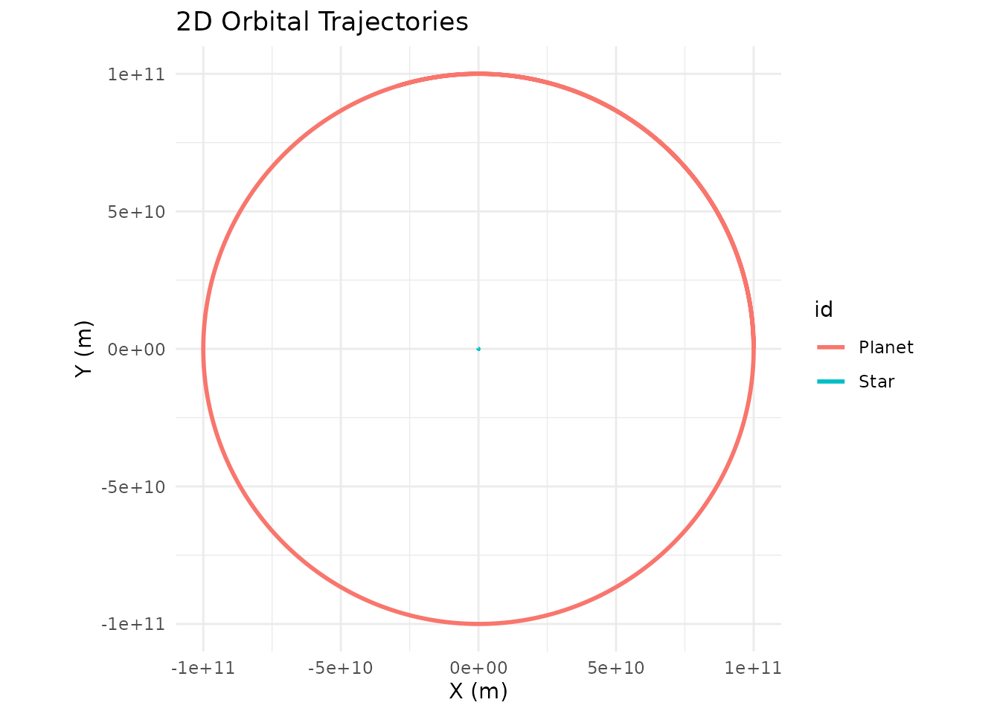
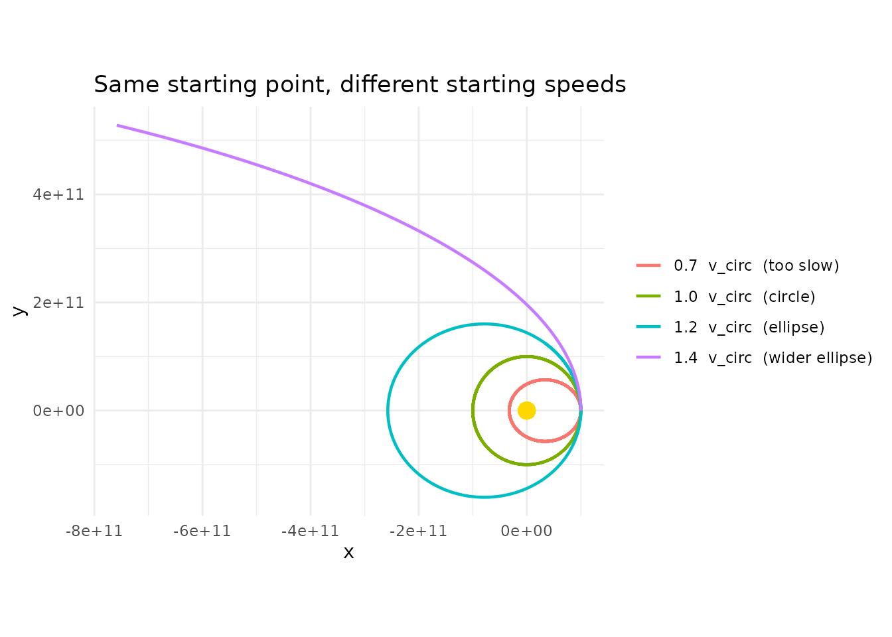
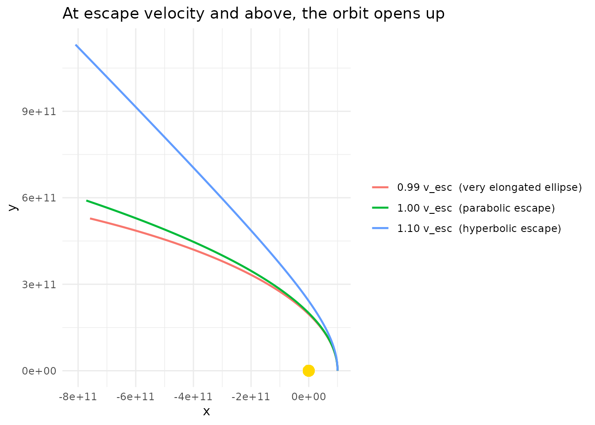
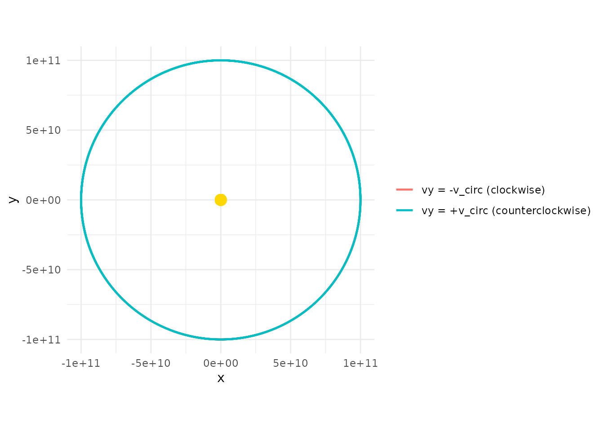
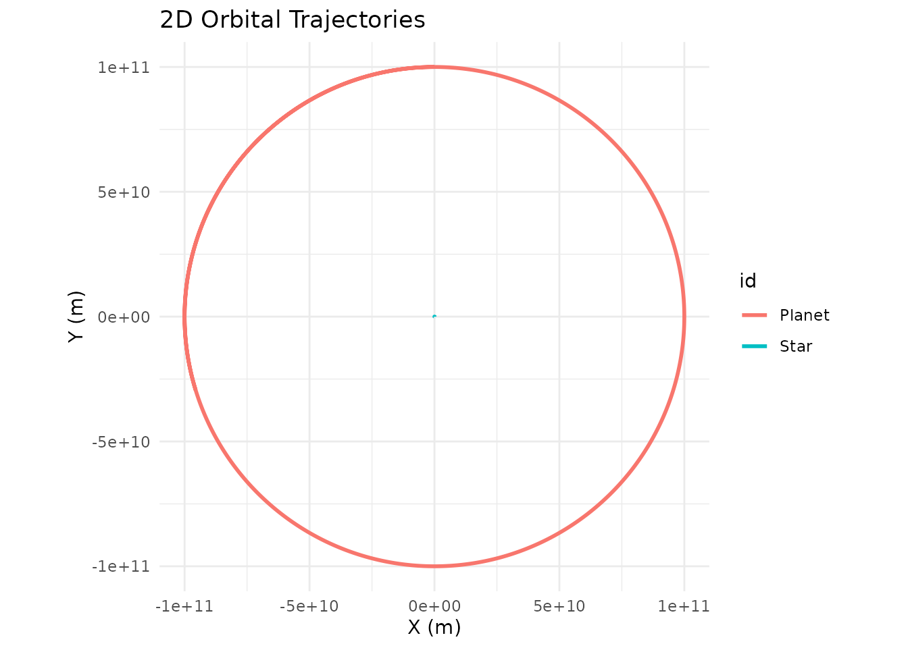

# Building Two-Body Orbits From Scratch

``` r
library(orbitr)
library(ggplot2)
library(dplyr)
```

Most tutorials hand you a finished orbit and ask you to trust that the
numbers are right. This guide goes the other way: it walks through the
decisions that shape a two-body orbit so that by the end you can dial in
any stable configuration you want from scratch.

The three things you need to decide are:

1.  Where each body starts (its **position**)
2.  How fast the orbiting body is moving and in what direction (its
    **velocity**)
3.  Which body is heavy enough to sit still at the center (its **mass**)

Get any of these wrong and the orbit either crashes, escapes, or looks
bizarrely eccentric. Get them right and the result is a clean closed
loop that repeats forever.

## The Convention: Central Body at the Origin

For any two-body problem, the easiest mental model is to put the heavier
body at the origin with zero velocity and give the lighter body all the
interesting initial conditions. This works as long as the central body
is *much* more massive than the orbiter — good for Sun/planet and
Earth/Moon, not so good for binary stars of comparable mass (more on
that at the end).

``` r
system <- create_system() |>
  add_body("Star",   mass = 1e30) |>                # heavy; sits at origin
  add_body("Planet", mass = 1e24, x = 1e11, vy = ?) # light; on the +x axis
```

That `?` in the velocity is the whole ballgame. Everything else follows
from how much sideways motion we give the planet at that starting
distance.

## Why Velocity Must Be Perpendicular to Position

Gravity always pulls the planet *radially* — straight toward the star
along the line connecting them. If the planet’s velocity has a component
pointing along that same radial line, the orbit won’t be symmetric: the
planet will either be falling inward or climbing outward at its starting
position, not at the closest or farthest point of its path.

For a clean circle or a symmetric ellipse with its major axis on a
coordinate plane, you want the starting velocity to be **perpendicular**
to the starting position vector. Put the planet on the +x axis
(`x = 1e11, y = 0`) and give it a purely vertical velocity
(`vx = 0, vy = v`). The starting position is then either the closest
point (perihelion) or the farthest point (aphelion) of the ellipse,
depending on whether `v` is above or below the circular speed.

This isn’t a physics requirement — any velocity produces a valid orbit —
but it makes the geometry much easier to reason about.

## The Circular Orbit Velocity

At distance $r$ from a central mass $M$, the speed that produces a
perfect circle is:

$$v_{\text{circ}} = \sqrt{\frac{G\, M}{r}}$$

In code:

``` r
M    <- 1e30         # central mass (kg)
r    <- 1e11         # starting distance (m)

v_circ <- sqrt(gravitational_constant * M / r)
v_circ
#> [1] 25834.67
```

Plug that into the planet’s `vy` and you get a circle:

``` r
create_system() |>
  add_body("Star",   mass = M) |>
  add_body("Planet", mass = 1e24, x = r, vy = v_circ) |>
  simulate_system(time_step = seconds_per_hour, duration = seconds_per_year) |>
  plot_orbits()
```



That’s it. One line of math, one call to
[`add_body()`](https://orbit-r.com/reference/add_body.md), and you have
a stable circular orbit.

## What Happens If You Get the Speed Wrong?

Real orbits are almost never perfect circles. The more interesting
question is: what does the orbit look like when `vy` *isn’t* exactly
`v_circ`? Let’s sweep through a few values and find out.

``` r
make_sim <- function(v, label) {
  create_system() |>
    add_body("Star",   mass = M) |>
    add_body("Planet", mass = 1e24, x = r, vy = v) |>
    simulate_system(time_step = seconds_per_hour, duration = seconds_per_year * 2) |>
    filter(id == "Planet") |>
    mutate(case = label)
}

bind_rows(
  make_sim(0.7  * v_circ, "0.7  v_circ  (too slow)"),
  make_sim(1.0  * v_circ, "1.0  v_circ  (circle)"),
  make_sim(1.2  * v_circ, "1.2  v_circ  (ellipse)"),
  make_sim(1.4  * v_circ, "1.4  v_circ  (wider ellipse)")
) |>
  ggplot(aes(x = x, y = y, color = case)) +
  geom_path(linewidth = 0.8) +
  geom_point(x = 0, y = 0, color = "gold", size = 4, inherit.aes = FALSE) +
  coord_equal() +
  theme_minimal() +
  labs(title = "Same starting point, different starting speeds",
       color = NULL)
```



A few things to notice:

- **At exactly `v_circ`** you get a circle.
- **Below `v_circ`**, the orbit is an ellipse whose *far* side is still
  at the starting distance `r`, and whose *near* side dips closer to the
  star. The starting point is aphelion (farthest point).
- **Above `v_circ`** (but below escape velocity), the orbit is an
  ellipse whose *near* side is the starting distance, and the *far* side
  swings out much further. The starting point is perihelion (closest
  point).
- **At or above $\sqrt{2} \cdot v_{\text{circ}}$**, the orbit is no
  longer bound — the planet escapes on a parabolic or hyperbolic
  trajectory and never comes back. We’ll see this in the next section.

The “too slow” case will actually crash into the star in this simulation
because with `softening = 0` the acceleration diverges at close
approach. That’s one reason the `unstable-orbits` vignette recommends
adding a softening length for anything that passes close to the center.

## Escape Velocity

If you push `vy` hard enough, the planet’s kinetic energy exceeds the
gravitational binding energy and it leaves forever. The threshold is:

$$v_{\text{esc}} = \sqrt{\frac{2\, G\, M}{r}} = \sqrt{2} \cdot v_{\text{circ}}$$

``` r
v_esc <- sqrt(2) * v_circ

bind_rows(
  make_sim(0.99 * v_esc, "0.99 v_esc  (very elongated ellipse)"),
  make_sim(1.00 * v_esc, "1.00 v_esc  (parabolic escape)"),
  make_sim(1.10 * v_esc, "1.10 v_esc  (hyperbolic escape)")
) |>
  ggplot(aes(x = x, y = y, color = case)) +
  geom_path(linewidth = 0.8) +
  geom_point(x = 0, y = 0, color = "gold", size = 4, inherit.aes = FALSE) +
  coord_equal() +
  theme_minimal() +
  labs(title = "At escape velocity and above, the orbit opens up",
       color = NULL)
```



Just below escape velocity you still have a (very stretched) closed
ellipse. At and above it, the trajectory is an open curve and the planet
never returns.

## Which Direction Does the Orbit Go?

The sign of `vy` sets the direction of travel. Starting on the +x axis:

- `vy > 0` → the planet moves in the +y direction initially →
  **counterclockwise** orbit (viewed from +z).
- `vy < 0` → the planet moves in the $-$y direction initially →
  **clockwise** orbit.

``` r
bind_rows(
  make_sim(  v_circ, "vy = +v_circ (counterclockwise)"),
  make_sim(- v_circ, "vy = -v_circ (clockwise)")
) |>
  ggplot(aes(x = x, y = y, color = case)) +
  geom_path(linewidth = 0.8) +
  geom_point(x = 0, y = 0, color = "gold", size = 4, inherit.aes = FALSE) +
  coord_equal() +
  theme_minimal() +
  labs(color = NULL)
```



Both traces the same circle — the only difference is the direction of
travel, which only becomes visually obvious in an animation.

## Rotating the Whole Setup

There’s nothing magical about the +x axis. If you’d rather place the
planet on the +y axis, you just swap: position goes in `y`, velocity
goes in `vx` (with the opposite sign convention for direction).

``` r
create_system() |>
  add_body("Star",   mass = M) |>
  add_body("Planet", mass = 1e24, y = r, vx = -v_circ) |>
  simulate_system(time_step = seconds_per_hour, duration = seconds_per_year) |>
  plot_orbits()
```



Same circle, rotated 90 degrees. You can place the planet anywhere in
the plane, as long as the velocity vector is perpendicular to the
position vector and has magnitude `v_circ` (for a circle) or some
deliberate deviation from it (for an ellipse).

## When the Central Body Isn’t Much Heavier

Everything above assumed the star is so heavy that it doesn’t move
appreciably. That’s a fine approximation when the mass ratio is
$\gtrsim 10^{4}$ (Sun/Earth is $\sim 3 \times 10^{5}$), but it breaks
down for binary stars, Pluto-Charon, or any system where the two masses
are comparable.

For those, both bodies orbit their common center of mass (the
**barycenter**), and you need to give *both* bodies initial velocities
that satisfy conservation of momentum. The [Kepler-16
example](https://orbit-r.com/articles/examples.md) shows how to do this
for a realistic binary-star-plus-planet system. The short version:

- Put the two bodies on opposite sides of the origin at distances
  inversely proportional to their masses.
- Give each an initial velocity in opposite directions, again inversely
  proportional to mass.
- The orbital speed of each body around the barycenter uses the *other*
  body’s mass and the total separation.

For anything resembling a planet around a much heavier star, the
single-body approach in this guide is all you need.

## Recap

To build a stable two-body orbit from scratch:

1.  Pick a central mass $M$ and place it at the origin with zero
    velocity.
2.  Pick a starting distance $r$ for the orbiter and place it on one
    axis (e.g. `x = r, y = 0, z = 0`).
3.  Compute $v_{\text{circ}} = \sqrt{GM/r}$.
4.  Give the orbiter a velocity perpendicular to its position vector
    (e.g. `vy = v_circ, vx = 0`). Use exactly `v_circ` for a circle,
    less for an inward ellipse, more for an outward ellipse,
    `sqrt(2) * v_circ` or above for an escape trajectory.

That’s the entire recipe. Every built-in example in `orbitr` — and every
custom system you build — boils down to applying these four steps to one
pair of bodies at a time.
