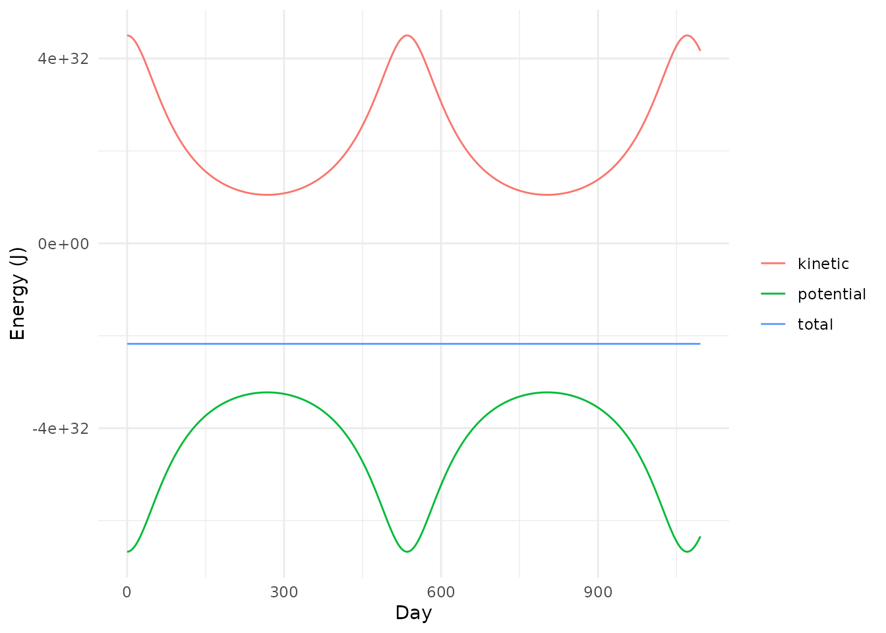
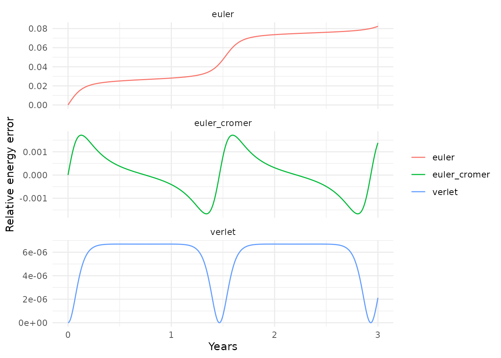
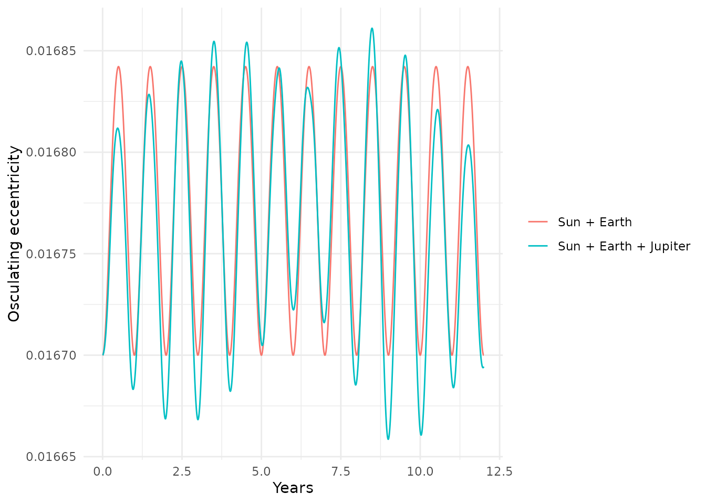
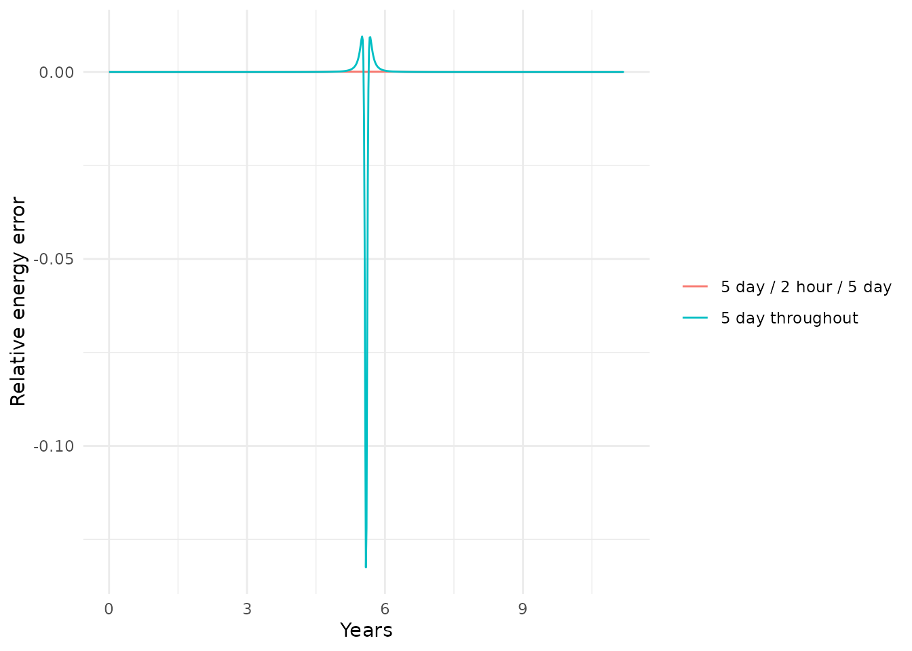

# Checking a Simulation

``` r

library(orbitr)
library(dplyr)
#> 
#> Attaching package: 'dplyr'
#> The following objects are masked from 'package:stats':
#> 
#>     filter, lag
#> The following objects are masked from 'package:base':
#> 
#>     intersect, setdiff, setequal, union
library(ggplot2)
```

A simulation always produces *something*. The question is whether the
something is physics or numerical artifact, and a plot of the
trajectories won’t always tell you. This article covers the functions
for finding out:
[`get_energy()`](https://orbit-r.com/reference/get_energy.md),
[`get_momentum()`](https://orbit-r.com/reference/get_momentum.md), and
[`get_angular_momentum()`](https://orbit-r.com/reference/get_momentum.md)
compute the quantities that real gravity keeps constant,
[`conserved_quantities()`](https://orbit-r.com/reference/conserved_quantities.md)
reports how well a run kept them,
[`get_orbital_elements()`](https://orbit-r.com/reference/get_orbital_elements.md)
tells you what orbit a body is actually on, and
[`continue_simulation()`](https://orbit-r.com/reference/continue_simulation.md)
lets you fix the most common problem — a time step that’s too large for
part of the run — without re-running everything.

## Energy, Momentum, and Angular Momentum

Newtonian gravity conserves three things exactly: total energy, total
linear momentum, and total angular momentum. Three getters compute them
at every time step of a run:

``` r

star_planet <- create_system() |>
  add_body("Star", mass = 1e30) |>
  add_body("Planet", mass = 1e24, x = 1e11, vy = 30000)

sim <- simulate_system(star_planet, time_step = seconds_per_hour * 6,
                       duration = seconds_per_year * 3)

get_energy(sim)
#> # A tibble: 4,384 × 4
#>      time kinetic potential   energy
#>     <dbl>   <dbl>     <dbl>    <dbl>
#>  1      0 4.50e32  -6.67e32 -2.17e32
#>  2  21600 4.50e32  -6.67e32 -2.17e32
#>  3  43200 4.50e32  -6.67e32 -2.17e32
#>  4  64800 4.50e32  -6.67e32 -2.17e32
#>  5  86400 4.50e32  -6.67e32 -2.17e32
#>  6 108000 4.50e32  -6.67e32 -2.17e32
#>  7 129600 4.50e32  -6.67e32 -2.17e32
#>  8 151200 4.50e32  -6.67e32 -2.17e32
#>  9 172800 4.50e32  -6.67e32 -2.17e32
#> 10 194400 4.50e32  -6.67e32 -2.17e32
#> # ℹ 4,374 more rows
```

`kinetic` is $`\sum \tfrac12 m v^2`$ over the bodies, `potential` is
$`-\sum G m_j m_k / r_{jk}`$ over the pairs, and `energy` is the total.
The two trade off along the orbit — the planet speeds up as it falls
inward — while the total stays put:

``` r

energy <- get_energy(sim)

bind_rows(
  energy |> transmute(time, name = "kinetic",   value = kinetic),
  energy |> transmute(time, name = "potential", value = potential),
  energy |> transmute(time, name = "total",     value = energy)
) |>
  ggplot(aes(x = time / seconds_per_day, y = value, color = name)) +
  geom_line() +
  labs(x = "Day", y = "Energy (J)", color = NULL) +
  theme_minimal()
```



[`get_momentum()`](https://orbit-r.com/reference/get_momentum.md) and
[`get_angular_momentum()`](https://orbit-r.com/reference/get_momentum.md)
do the same for $`\mathbf{P} = \sum m \mathbf{v}`$ and
$`\mathbf{L} = \sum m\, \mathbf{r} \times \mathbf{v}`$:

``` r

get_momentum(sim)
#> # A tibble: 4,384 × 4
#>      time            px    py    pz
#>     <dbl>         <dbl> <dbl> <dbl>
#>  1      0             0  3e28     0
#>  2  21600  -17179869184  3e28     0
#>  3  43200             0  3e28     0
#>  4  64800   68719476736  3e28     0
#>  5  86400   68719476736  3e28     0
#>  6 108000             0  3e28     0
#>  7 129600             0  3e28     0
#>  8 151200 -137438953472  3e28     0
#>  9 172800  137438953472  3e28     0
#> 10 194400             0  3e28     0
#> # ℹ 4,374 more rows
get_angular_momentum(sim)
#> # A tibble: 4,384 × 4
#>      time    Lx    Ly    Lz
#>     <dbl> <dbl> <dbl> <dbl>
#>  1      0     0     0  3e39
#>  2  21600     0     0  3e39
#>  3  43200     0     0  3e39
#>  4  64800     0     0  3e39
#>  5  86400     0     0  3e39
#>  6 108000     0     0  3e39
#>  7 129600     0     0  3e39
#>  8 151200     0     0  3e39
#>  9 172800     0     0  3e39
#> 10 194400     0     0  3e39
#> # ℹ 4,374 more rows
```

The total momentum here is not zero — the star was started at rest while
the planet moves — so the system’s center of mass drifts. That’s not an
error; it’s what `shift_reference_frame(sim, "barycenter")` is for.

## Conserved Quantities

A numerical integrator does not conserve all three exactly, and how
badly it fails is a direct measure of how much to trust the run.
[`conserved_quantities()`](https://orbit-r.com/reference/conserved_quantities.md)
joins the three getters and adds each quantity’s relative error against
its initial value:

``` r

cq <- conserved_quantities(sim)
cq
#> # A tibble: 4,384 × 13
#>      time kinetic potential   energy            px    py    pz    Lx    Ly    Lz
#>     <dbl>   <dbl>     <dbl>    <dbl>         <dbl> <dbl> <dbl> <dbl> <dbl> <dbl>
#>  1      0 4.50e32  -6.67e32 -2.17e32             0  3e28     0     0     0  3e39
#>  2  21600 4.50e32  -6.67e32 -2.17e32  -17179869184  3e28     0     0     0  3e39
#>  3  43200 4.50e32  -6.67e32 -2.17e32             0  3e28     0     0     0  3e39
#>  4  64800 4.50e32  -6.67e32 -2.17e32   68719476736  3e28     0     0     0  3e39
#>  5  86400 4.50e32  -6.67e32 -2.17e32   68719476736  3e28     0     0     0  3e39
#>  6 108000 4.50e32  -6.67e32 -2.17e32             0  3e28     0     0     0  3e39
#>  7 129600 4.50e32  -6.67e32 -2.17e32             0  3e28     0     0     0  3e39
#>  8 151200 4.50e32  -6.67e32 -2.17e32 -137438953472  3e28     0     0     0  3e39
#>  9 172800 4.50e32  -6.67e32 -2.17e32  137438953472  3e28     0     0     0  3e39
#> 10 194400 4.50e32  -6.67e32 -2.17e32             0  3e28     0     0     0  3e39
#> # ℹ 4,374 more rows
#> # ℹ 3 more variables: energy_error <dbl>, momentum_error <dbl>,
#> #   angular_momentum_error <dbl>
```

What should you expect?

- **Momentum and angular momentum** should sit at floating-point
  rounding, around `1e-15`, for the Velocity Verlet and Euler-Cromer
  integrators, at *any* time step. Both methods are built from “kicks”
  (velocity updates) and “drifts” (position updates) that conserve these
  two quantities exactly. If either one drifts, the problem is in your
  setup, not the step size.
- **Energy** is conserved only approximately. With Verlet the error
  oscillates once per orbit and stays inside a band whose width scales
  as the square of the time step. It should not grow.

Here are all three integrators side by side:

``` r

runs <- bind_rows(lapply(c("verlet", "euler_cromer", "euler"), function(m) {
  simulate_system(star_planet, time_step = seconds_per_hour * 6,
                  duration = seconds_per_year * 3, method = m) |>
    conserved_quantities() |>
    mutate(method = m)
}))

runs |>
  ggplot(aes(x = time / seconds_per_year, y = energy_error, color = method)) +
  geom_line() +
  facet_wrap(~ method, scales = "free_y", ncol = 1) +
  labs(x = "Years", y = "Relative energy error", color = NULL) +
  theme_minimal()
```



Verlet’s error is a bounded wiggle. Euler-Cromer’s is a larger bounded
wiggle. Euler’s climbs without limit — that’s the energy being pumped
into the orbit that makes it spiral outward. The angular momentum column
tells the same story more sharply:

``` r

runs |>
  group_by(method) |>
  summarise(max_angular_momentum_error = max(angular_momentum_error),
            max_energy_error = max(abs(energy_error)))
#> # A tibble: 3 × 3
#>   method       max_angular_momentum_error max_energy_error
#>   <chr>                             <dbl>            <dbl>
#> 1 euler                          3.75e- 2       0.0824    
#> 2 euler_cromer                   4.43e-15       0.00171   
#> 3 verlet                         3.02e-15       0.00000669
```

### Reading the energy plot

Four shapes cover almost everything:

- **A narrow oscillating band** — healthy. Halving the step should
  shrink it by about four.
- **A wide oscillating band** — the step is too large for the tightest
  or most eccentric orbit in the system. Halve it and compare.
- **A steady drift** — either `method = "euler"`, or a step so large
  that even Verlet’s guarantees have broken down.
- **A sudden jump** — a close encounter the step couldn’t resolve.
  Everything after the jump is on a different orbit from everything
  before it.

One thing to know: if you ran with `softening`, the system conserves the
*softened* energy.
[`get_energy()`](https://orbit-r.com/reference/get_energy.md) and
[`conserved_quantities()`](https://orbit-r.com/reference/conserved_quantities.md)
read the softening value the simulation was run with from the output, so
this is handled automatically; if you compute energy yourself, use the
same softened distance.

## What Orbit Is It Actually On?

[`add_body_keplerian()`](https://orbit-r.com/reference/add_body_keplerian.md)
turns six orbital elements into a position and velocity.
[`get_orbital_elements()`](https://orbit-r.com/reference/get_orbital_elements.md)
goes the other way: from the simulated position and velocity of a body
relative to a parent, it recovers the semi-major axis, eccentricity,
inclination, node, argument of periapsis, and true anomaly at every time
step.

``` r

mars <- create_system() |>
  add_sun() |>
  add_planet("Mars", parent = "Sun", nu = 45) |>
  simulate_system(time_step = seconds_per_day, duration = seconds_per_day * 687)

elements <- get_orbital_elements(mars, "Mars", "Sun")
elements
#> # A tibble: 688 × 8
#>      time             a      e     i   lan arg_pe    nu    period
#>     <dbl>         <dbl>  <dbl> <dbl> <dbl>  <dbl> <dbl>     <dbl>
#>  1      0 227900000000. 0.0934  1.85  49.6   286.  45.0 59330240.
#>  2  86400 227900009834. 0.0934  1.85  49.6   286.  45.6 59330244.
#>  3 172800 227900019718. 0.0934  1.85  49.6   286.  46.2 59330247.
#>  4 259200 227900029649. 0.0934  1.85  49.6   286.  46.8 59330251.
#>  5 345600 227900039625. 0.0934  1.85  49.6   286.  47.4 59330255.
#>  6 432000 227900049643. 0.0934  1.85  49.6   286.  48.0 59330259.
#>  7 518400 227900059701. 0.0934  1.85  49.6   286.  48.6 59330263.
#>  8 604800 227900069797. 0.0934  1.85  49.6   286.  49.2 59330267.
#>  9 691200 227900079927. 0.0934  1.85  49.6   286.  49.8 59330271.
#> 10 777600 227900090090. 0.0934  1.85  49.6   286.  50.4 59330275.
#> # ℹ 678 more rows
```

For a two-body system the elements are constants of the motion, so the
only thing that changes along the run is `nu`, the position on the
orbit. How constant the rest are is another integration check:

``` r

elements |>
  summarise(a_spread = max(a) - min(a),
            e_spread = max(e) - min(e),
            period_days = mean(period) / seconds_per_day)
#> # A tibble: 1 × 3
#>   a_spread  e_spread period_days
#>      <dbl>     <dbl>       <dbl>
#> 1 1861037. 0.0000433        687.
```

With a third body the elements are no longer constant — the orbit is
being perturbed, and the elements at each instant describe the
*osculating* orbit, the ellipse the body would follow from that moment
if the perturbation were switched off. Watching them drift is how
astronomers describe perturbations. Here is Earth’s eccentricity with
and without Jupiter:

``` r

earth_alone <- create_system() |>
  add_sun() |>
  add_planet("Earth", parent = "Sun") |>
  simulate_system(time_step = seconds_per_day, duration = seconds_per_year * 12)

earth_jupiter <- create_system() |>
  add_sun() |>
  add_planet("Earth", parent = "Sun") |>
  add_planet("Jupiter", parent = "Sun", nu = 90) |>
  simulate_system(time_step = seconds_per_day, duration = seconds_per_year * 12)

bind_rows(
  get_orbital_elements(earth_alone, "Earth", "Sun") |> mutate(system = "Sun + Earth"),
  get_orbital_elements(earth_jupiter, "Earth", "Sun") |> mutate(system = "Sun + Earth + Jupiter")
) |>
  ggplot(aes(x = time / seconds_per_year, y = e, color = system)) +
  geom_line() +
  labs(x = "Years", y = "Osculating eccentricity", color = NULL) +
  theme_minimal()
```



The wiggles repeat each time Jupiter laps Earth, and they are real
physics, not integration error — the Sun + Earth line is flat.

The elements are also the sharpest test of a time step there is. Energy
conservation is necessary but not sufficient: a Verlet run with too
coarse a step can keep energy bounded while its orbit slowly *precesses*
for no physical reason. If `arg_pe` drifts in a two-body run, that’s the
integrator, and the drift rate falls by about four when you halve the
step.

### A note on the gravitational parameter

By default
[`get_orbital_elements()`](https://orbit-r.com/reference/get_orbital_elements.md)
uses $`\mu = G M_{\text{parent}}`$, the same convention as
[`add_body_keplerian()`](https://orbit-r.com/reference/add_body_keplerian.md),
so elements round-trip exactly. The simulation itself moves both bodies,
and the true two-body orbit has
$`\mu = G(M_{\text{parent}} + m_{\text{body}})`$. The difference is
negligible for every planet, and about 1% for the Moon; pass
`mu = gravitational_constant * (mass_earth + mass_moon)` if you need the
exact lunar orbit.

## Continuing a Run

[`simulate_system()`](https://orbit-r.com/reference/simulate_system.md)
uses one fixed time step for the whole run. That’s the right design for
planets, and the wrong one for a comet: Halley’s Comet spends 73 of its
75 years crawling through the outer solar system and a few weeks
sprinting around the Sun at sixty times the speed. A step that is fine
at aphelion is useless at perihelion.

[`continue_simulation()`](https://orbit-r.com/reference/continue_simulation.md)
picks up a run from its last state with whatever step you like, and
appends the new rows with `time` continuing from where it left off. So
you can take large steps where nothing happens and small ones where
everything does:

``` r

comet <- create_system() |>
  add_sun() |>
  add_body_keplerian("Comet", mass = 1e14, parent = "Sun",
                     a = 5 * distance_earth_sun, e = 0.9, nu = 180)

# Coarse on the way in, fine through perihelion, coarse on the way out
segmented <- comet |>
  simulate_system(time_step = seconds_per_day * 5, duration = seconds_per_year * 4.9) |>
  continue_simulation(time_step = seconds_per_hour * 2, duration = seconds_per_year * 1.4) |>
  continue_simulation(time_step = seconds_per_day * 5, duration = seconds_per_year * 4.9)

n_distinct(segmented$time)
#> [1] 6851
```

Compare with the same orbit run entirely at the coarse step:

``` r

uniform <- simulate_system(comet, time_step = seconds_per_day * 5,
                           duration = seconds_per_year * 11.2)

bind_rows(
  conserved_quantities(segmented) |> mutate(run = "5 day / 2 hour / 5 day"),
  conserved_quantities(uniform)   |> mutate(run = "5 day throughout")
) |>
  ggplot(aes(x = time / seconds_per_year, y = energy_error, color = run)) +
  geom_line() +
  labs(x = "Years", y = "Relative energy error", color = NULL) +
  theme_minimal()
```



The uniform run makes all of its error in the few weeks around
perihelion, in one spurious kick, and leaves on a different orbit. The
segmented run resolves the passage at a small fraction of the cost of
taking two-hour steps for eleven years.

[`continue_simulation()`](https://orbit-r.com/reference/continue_simulation.md)
reads the gravitational constant, integrator, and softening from the
previous segment, so you only need to say what changes. Each segment is
an ordinary Verlet run; the only disturbance is about one step’s worth
of error at each switch.

### Editing between segments

Because the handoff goes through the output tibble, you can change the
state between segments: give a body a velocity kick (a rocket burn),
remove one, or add one with
[`system_from_simulation()`](https://orbit-r.com/reference/system_from_simulation.md),
which rebuilds an `orbit_system` from any snapshot:

``` r

later <- system_from_simulation(segmented, time = seconds_per_year * 5)
later
#> ───────────────────────────────── orbit_system ───────────────────────────────── 
#> G: 6.6743e-11 (standard)
#> Bodies: 2
#> 
#> # A tibble: 2 × 8
#>   id       mass         x         y     z        vx        vy    vz
#>   <chr>   <dbl>     <dbl>     <dbl> <dbl>     <dbl>     <dbl> <dbl>
#> 1 Sun   1.99e30 -5.28e- 5 -9.25e- 6     0 -9.63e-13 -3.39e-13     0
#> 2 Comet 1   e14 -3.71e+11 -2.98e+11     0  1.92e+ 4  3.69e+ 3     0
```

Modify it with [`add_body()`](https://orbit-r.com/reference/add_body.md)
or [`remove_body()`](https://orbit-r.com/reference/remove_body.md) like
any other system, and simulate again.
