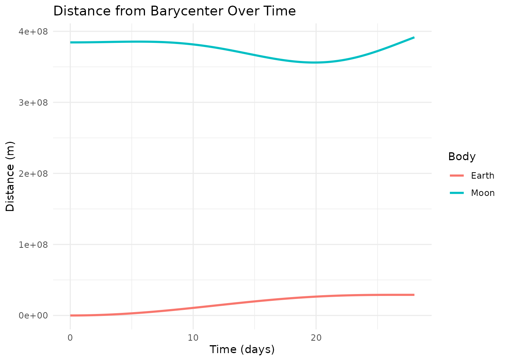
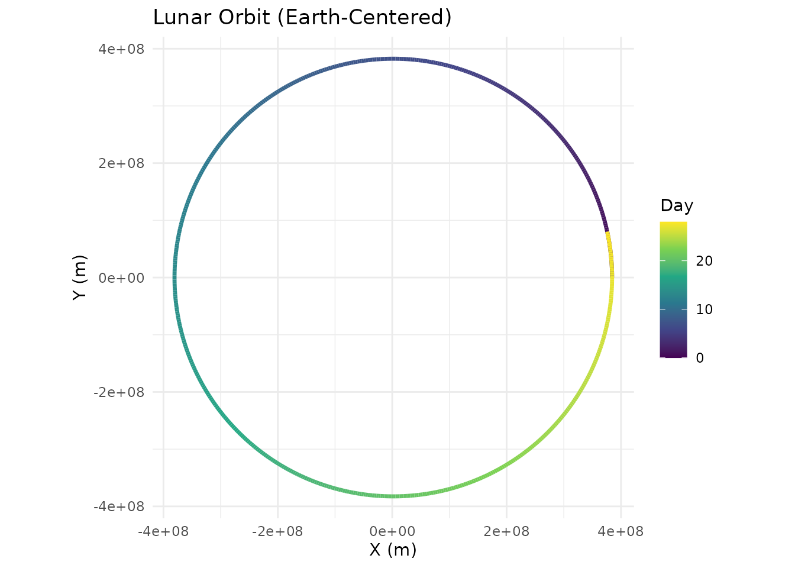

# Custom Visualization with ggplot2 and plotly

``` r
library(orbitr)
```

[`plot_orbits()`](https://drosenman.github.io/orbitr/reference/plot_orbits.md)
and
[`plot_orbits_3d()`](https://drosenman.github.io/orbitr/reference/plot_orbits_3d.md)
are convenience functions for quick trajectory plots — they’re designed
to get you a useful visualization in one line so you can focus on
setting up the physics. But the real power of `orbitr` is that
[`simulate_system()`](https://drosenman.github.io/orbitr/reference/simulate_system.md)
returns a standard tidy tibble. You can use `ggplot2`, `plotly`, or any
other visualization tool directly on the output.

## The Raw Output

Here’s what the simulation tibble looks like:

``` r
sim <- create_system() |>
  add_body("Earth", mass = mass_earth) |>
  add_body("Moon",  mass = mass_moon, x = distance_earth_moon, vy = speed_moon) |>
  simulate_system(time_step = 3600, duration = 86400 * 28)

sim
#> # A tibble: 1,346 × 9
#>    id       mass          x           y     z      vx          vy    vz  time
#>    <chr>   <dbl>      <dbl>       <dbl> <dbl>   <dbl>       <dbl> <dbl> <dbl>
#>  1 Earth 5.97e24         0         0        0   0        0            0     0
#>  2 Moon  7.34e22 384400000         0        0   0     1022            0     0
#>  3 Earth 5.97e24       215.        0        0   0.119    0.000571     0  3600
#>  4 Moon  7.34e22 384382520.  3679200        0  -9.71  1022.           0  3600
#>  5 Earth 5.97e24       860.        4.11     0   0.239    0.00229      0  7200
#>  6 Moon  7.34e22 384330083.  7358065.       0 -19.4   1022.           0  7200
#>  7 Earth 5.97e24      1934.       16.5      0   0.358    0.00514      0 10800
#>  8 Moon  7.34e22 384242692. 11036262.       0 -29.1   1022.           0 10800
#>  9 Earth 5.97e24      3438.       41.1      0   0.477    0.00914      0 14400
#> 10 Moon  7.34e22 384120357. 14713454.       0 -38.8   1021.           0 14400
#> # ℹ 1,336 more rows
```

Each row is one body at one point in time. Every column is available for
plotting, filtering, or analysis. Since this is just a tibble, you have
the full power of `dplyr` and `ggplot2` at your disposal.

## Custom ggplot2 Visualizations

For example, in the Earth-Moon system,
[`plot_orbits()`](https://drosenman.github.io/orbitr/reference/plot_orbits.md)
shows overlapping circles because both bodies orbit their shared
barycenter at roughly the same scale. A more useful visualization might
plot each body’s distance from the barycenter over time:

``` r
library(ggplot2)

sim |>
  dplyr::mutate(r = sqrt(x^2 + y^2)) |>
  ggplot(aes(x = time / 86400, y = r, color = id)) +
  geom_line(linewidth = 1) +
  labs(
    title = "Distance from Barycenter Over Time",
    x = "Time (days)",
    y = "Distance (m)",
    color = "Body"
  ) +
  theme_minimal()
```



Or plot the Moon’s path relative to Earth with a color gradient showing
the passage of time:

``` r
sim |>
  shift_reference_frame("Earth", keep_center = FALSE) |>
  ggplot(aes(x = x, y = y, color = time / 86400)) +
  geom_path(linewidth = 1.2) +
  scale_color_viridis_c(name = "Day") +
  coord_equal() +
  labs(title = "Lunar Orbit (Earth-Centered)", x = "X (m)", y = "Y (m)") +
  theme_minimal()
```



## Custom plotly Visualizations

Just as
[`plot_orbits()`](https://drosenman.github.io/orbitr/reference/plot_orbits.md)
is a quick convenience for 2D work,
[`plot_orbits_3d()`](https://drosenman.github.io/orbitr/reference/plot_orbits_3d.md)
is a quick convenience for 3D. Both are intentionally simple — they get
you a useful plot in one line so you can focus on the physics, not the
formatting. When you need more control, the simulation tibble works just
as well with `plotly` as it does with `ggplot2`.

For example, you could color trajectories by speed rather than by body:

``` r
library(plotly)
#> 
#> Attaching package: 'plotly'
#> The following object is masked from 'package:ggplot2':
#> 
#>     last_plot
#> The following object is masked from 'package:stats':
#> 
#>     filter
#> The following object is masked from 'package:graphics':
#> 
#>     layout

sim <- create_system() |>
  add_body("Earth", mass = mass_earth) |>
  add_body("Moon",  mass = mass_moon,
           x = distance_earth_moon,
           vy = speed_moon * cos(5 * pi / 180),
           vz = speed_moon * sin(5 * pi / 180)) |>
  simulate_system(time_step = 3600, duration = 86400 * 28)

sim <- sim |>
  dplyr::mutate(speed = sqrt(vx^2 + vy^2 + vz^2))

plot_ly() |>
  add_trace(
    data = dplyr::filter(sim, id == "Moon"),
    x = ~x, y = ~y, z = ~z,
    type = 'scatter3d', mode = 'lines',
    line = list(
      width = 5,
      color = ~speed,
      colorscale = 'Viridis',
      showscale = TRUE,
      colorbar = list(title = "Speed (m/s)")
    ),
    name = "Moon"
  ) |>
  add_trace(
    data = dplyr::filter(sim, id == "Earth"),
    x = ~x, y = ~y, z = ~z,
    type = 'scatter3d', mode = 'lines',
    line = list(width = 3, color = 'gray'),
    name = "Earth"
  ) |>
  layout(
    title = "Lunar Orbit Around Earth",
    showlegend = FALSE,
    scene = list(
      xaxis = list(title = 'X (m)'),
      yaxis = list(title = 'Y (m)'),
      zaxis = list(title = 'Z (m)'),
      aspectmode = "data"
    )
  )
```

The point is the same as with `ggplot2`:
[`simulate_system()`](https://drosenman.github.io/orbitr/reference/simulate_system.md)
returns a standard tibble, so you have full access to `plotly`’s API for
anything the built-in plotting functions don’t cover.
