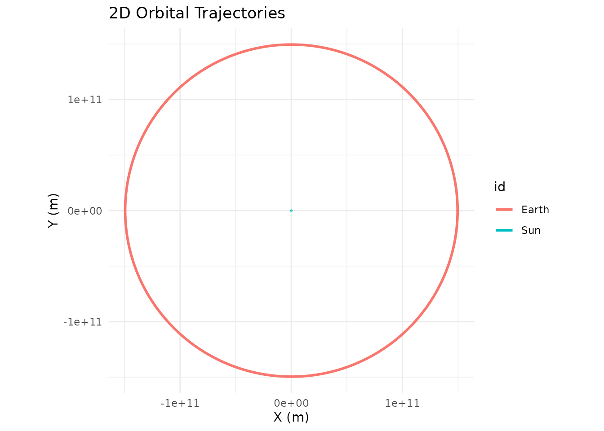
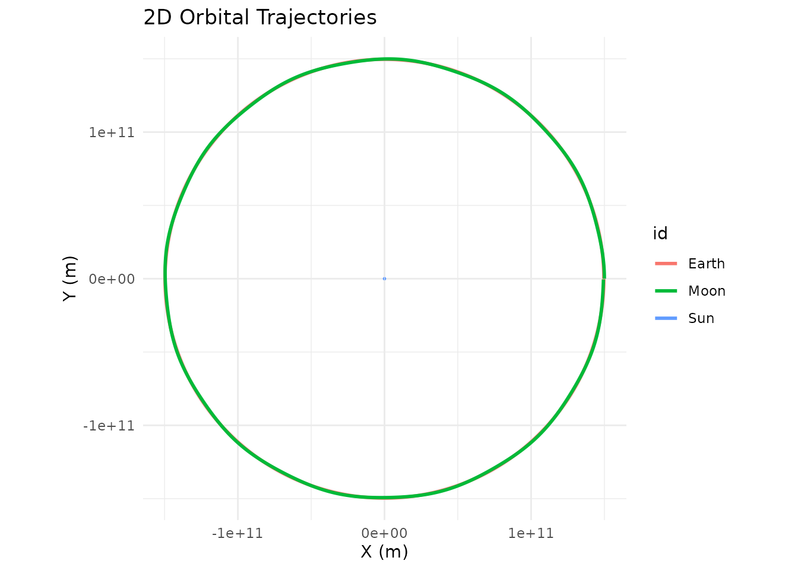

# Examples

``` r
library(orbitr)
```

## The Earth-Moon System

A standard 28-day lunar orbit. One-hour time steps.

``` r
create_system() |>
  add_body("Earth", mass = mass_earth) |>
  add_body("Moon",  mass = mass_moon, x = distance_earth_moon, vy = speed_moon) |>
  simulate_system(time_step = 3600, duration = 86400 * 28) |>
  plot_orbits()
```


## The Sun-Earth System

A full year with daily time steps.

``` r
create_system() |>
  add_body("Sun",   mass = mass_sun) |>
  add_body("Earth", mass = mass_earth, x = distance_earth_sun, vy = speed_earth) |>
  simulate_system(time_step = 86400, duration = 86400 * 365) |>
  plot_orbits()
```



## The Three-Body Problem (Sun-Earth-Moon)

Because `orbitr` uses N-body gravity, nested hierarchies require no
special setup. Piggyback the Moon’s initial conditions onto Earth’s
using simple vector addition. Note that at this scale, the Earth and
Moon orbits overlap — the Earth-Moon distance (~384,000 km) is tiny
compared to the Earth-Sun distance (~150 million km). Use
`shift_reference_frame("Earth")` (shown in the next example) to zoom
into the Earth-Moon subsystem:

``` r
create_system() |>
  add_body("Sun",   mass = mass_sun) |>
  add_body("Earth", mass = mass_earth, x = distance_earth_sun, vy = speed_earth) |>
  add_body("Moon",  mass = mass_moon,
           x = distance_earth_sun + distance_earth_moon,
           vy = speed_earth + speed_moon) |>
  simulate_system(time_step = 3600, duration = 86400 * 365) |>
  plot_orbits()
```



## Shifting Your Point of View

The three-body plot above is heliocentric (Sun at center). To see the
Moon’s path *from Earth’s perspective*, pipe the results through
[`shift_reference_frame()`](https://drosenman.github.io/orbitr/reference/shift_reference_frame.md):

``` r
create_system() |>
  add_body("Sun",   mass = mass_sun) |>
  add_body("Earth", mass = mass_earth, x = distance_earth_sun, vy = speed_earth) |>
  add_body("Moon",  mass = mass_moon,
           x = distance_earth_sun + distance_earth_moon,
           vy = speed_earth + speed_moon) |>
  simulate_system(time_step = 3600, duration = 86400 * 365) |>
  shift_reference_frame("Earth") |>
  plot_orbits()
```


## The Kepler-16 System: A Real Circumbinary Planet

Kepler-16b was the first confirmed planet orbiting two stars — a
real-life Tatooine. The system has a K-type star (0.68 solar masses) and
an M-type star (0.20 solar masses) orbiting each other every ~41 days,
with a Saturn-sized planet orbiting the pair at about 0.7 AU.

``` r
G <- 6.6743e-11
AU <- distance_earth_sun

# Star masses
m_A <- 0.68 * mass_sun
m_B <- 0.20 * mass_sun
m_planet <- 0.333 * mass_jupiter

# Binary star orbit (~0.22 AU separation)
a_bin <- 0.22 * AU
r_A <- a_bin * m_B / (m_A + m_B)
r_B <- a_bin * m_A / (m_A + m_B)
v_A <- sqrt(G * m_B^2 / ((m_A + m_B) * a_bin))
v_B <- sqrt(G * m_A^2 / ((m_A + m_B) * a_bin))

# Planet orbit (0.7048 AU from barycenter)
r_planet <- 0.7048 * AU
v_planet <- sqrt(G * (m_A + m_B) / r_planet)

create_system() |>
  add_body("Star A", mass = m_A, x = r_A, vy = v_A) |>
  add_body("Star B", mass = m_B, x = -r_B, vy = -v_B) |>
  add_body("Kepler-16b", mass = m_planet, x = r_planet, vy = v_planet) |>
  simulate_system(time_step = 3600, duration = 86400 * 228.8 * 3) |>
  plot_orbits()
```


