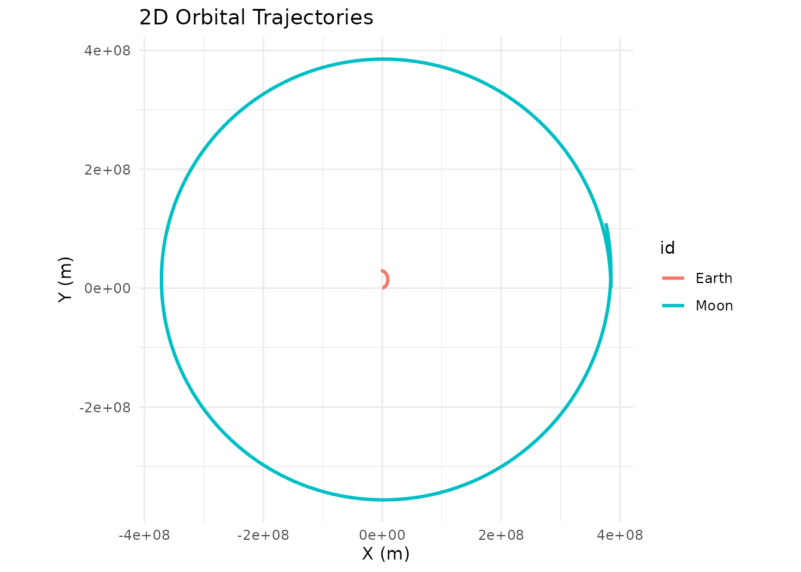
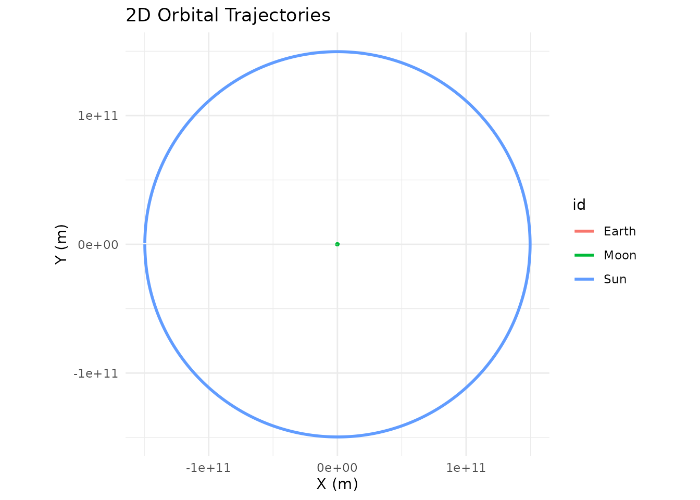
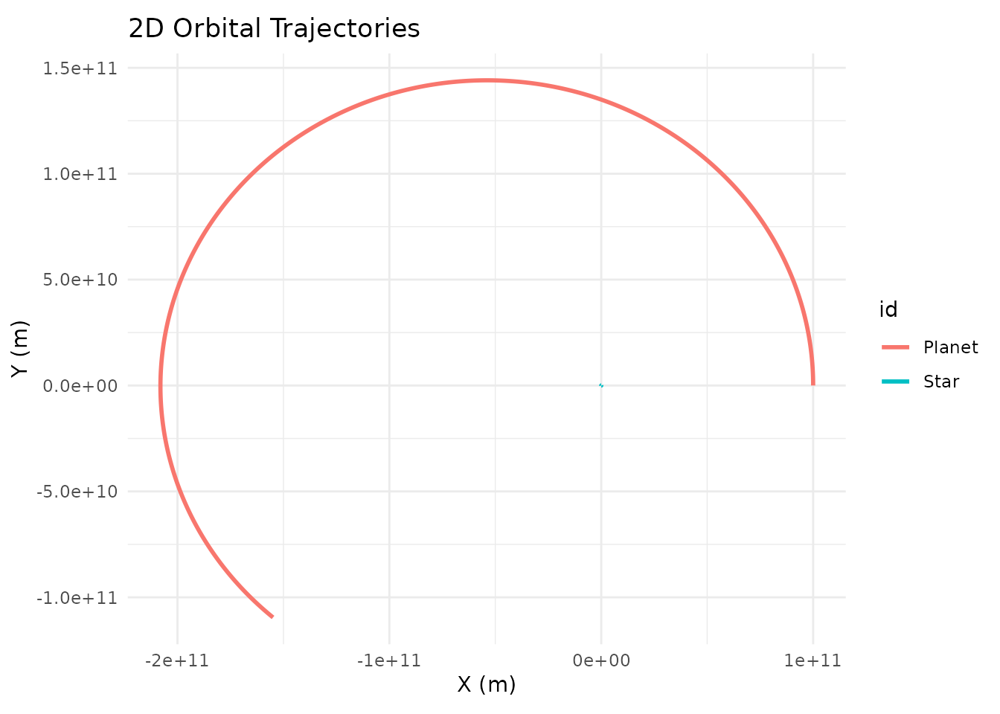

# Quick Start Guide

## Installation

``` r
# install.packages("devtools")
devtools::install_github("daverosenman/orbitr")
```

For 3D interactive plotting, you’ll also want:

``` r
install.packages("plotly")
```

## Your First Simulation in 30 Seconds

`orbitr` is designed around a simple pipe-friendly workflow: create a
system, add bodies, simulate, and plot.

``` r
library(orbitr)

create_system() |>
  add_body("Earth", mass = mass_earth) |>
  add_body("Moon",  mass = mass_moon, x = distance_earth_moon, vy = speed_moon) |>
  simulate_system(time_step = 3600, duration = 86400 * 28) |>
  plot_orbits()
```



That’s it — a 28-day lunar orbit in four lines. Here’s what each step
does:

1.  **[`create_system()`](https://drosenman.github.io/orbitr/reference/create_system.md)**
    initializes an empty simulation with standard gravitational constant
    G.
2.  **[`add_body()`](https://drosenman.github.io/orbitr/reference/add_body.md)**
    places a body with a given mass, position, and velocity. All
    positions are in meters, velocities in m/s. The built-in constants
    (`mass_earth`, `distance_earth_moon`, etc.) save you from looking
    anything up.
3.  **[`simulate_system()`](https://drosenman.github.io/orbitr/reference/simulate_system.md)**
    runs the N-body integration forward in time. `time_step` is how many
    seconds per integration step, `duration` is the total time to
    simulate.
4.  **[`plot_orbits()`](https://drosenman.github.io/orbitr/reference/plot_orbits.md)**
    produces a quick 2D trajectory plot using `ggplot2`.

## Customizing the Plot

By default,
[`plot_orbits()`](https://drosenman.github.io/orbitr/reference/plot_orbits.md)
returns a standard `ggplot` object for planar (2D) simulations and a
`plotly` HTML widget for simulations with any 3D motion. (You can also
force 3D rendering on planar data with `three_d = TRUE`.) Because the 2D
case returns a regular ggplot, you can layer additional geoms, scales,
themes, and labels onto it with `+` like any other ggplot.

A common annoyance is that the central body in a two-body system can be
invisible:
[`plot_orbits()`](https://drosenman.github.io/orbitr/reference/plot_orbits.md)
draws each body as a
[`geom_path()`](https://ggplot2.tidyverse.org/reference/geom_path.html)
of its trajectory, and a much more massive body barely moves so its path
is too small to see. The Sun in a Sun-Earth simulation is the classic
example — it’s there, but its loop around the barycenter is well inside
the Sun itself. The simplest fix is to drop a marker at the origin:

``` r
sim <- create_system() |>
  add_body("Sun",   mass = mass_sun) |>
  add_body("Earth", mass = mass_earth, x = distance_earth_sun, vy = speed_earth) |>
  simulate_system(time_step = 86400, duration = 86400 * 365)

sim |>
  plot_orbits() +
  ggplot2::geom_point(
    data = data.frame(x = 0, y = 0),
    ggplot2::aes(x = x, y = y),
    color = "gold",
    size = 6
  ) +
  ggplot2::labs(title = "Earth-Sun Orbit")
```

This works because the Sun sits essentially at the origin throughout the
simulation. For systems where the central body actually moves a
noticeable amount, you’d want to pull its position from the simulation
tibble instead of hardcoding `(0, 0)`.

## Adding More Bodies

Since `orbitr` is a full N-body engine, you can add as many bodies as
you want. Each one gravitationally interacts with every other. Here’s
the Sun-Earth-Moon system for a full year:

``` r
create_system() |>
  add_body("Sun",   mass = mass_sun) |>
  add_body("Earth", mass = mass_earth, x = distance_earth_sun, vy = speed_earth) |>
  add_body("Moon",  mass = mass_moon,
           x = distance_earth_sun + distance_earth_moon,
           vy = speed_earth + speed_moon) |>
  simulate_system(time_step = 3600, duration = 86400 * 365) |>
  shift_reference_frame("Earth") |>
  plot_orbits()
```



Notice `shift_reference_frame("Earth")` — this re-centers everything on
Earth so you can see the Moon’s orbit instead of having everything
overlap at the Sun’s scale.

## Changing the Integrator

The default integrator is Velocity Verlet, which conserves energy and
keeps orbits stable. You can switch to `"euler_cromer"` for faster (but
less accurate) runs, or `"euler"` to see what happens when energy isn’t
conserved:

``` r
create_system() |>
  add_body("Star", mass = 1e30) |>
  add_body("Planet", mass = 1e24, x = 1e11, vy = 30000) |>
  simulate_system(time_step = 3600, duration = 86400 * 365, method = "euler") |>
  plot_orbits()
```



You’ll see the orbit spiral outward — that’s the Euler method
artificially pumping energy into the system. Switch back to
`method = "verlet"` for a clean closed ellipse.

## The Output is Just a Tibble

[`simulate_system()`](https://drosenman.github.io/orbitr/reference/simulate_system.md)
returns a standard tidy tibble. You can use `dplyr`, `ggplot2`,
`plotly`, or any other tool on it:

``` r
sim <- create_system() |>
  add_body("Earth", mass = mass_earth) |>
  add_body("Moon",  mass = mass_moon, x = distance_earth_moon, vy = speed_moon) |>
  simulate_system(time_step = 3600, duration = 86400 * 28)

sim
#> # A tibble: 1,346 × 9
#>    id       mass          x           y     z      vx          vy    vz  time
#>    <chr>   <dbl>      <dbl>       <dbl> <dbl>   <dbl>       <dbl> <dbl> <dbl>
#>  1 Earth 5.97e24         0         0        0   0        0            0     0
#>  2 Moon  7.34e22 384400000         0        0   0     1022            0     0
#>  3 Earth 5.97e24       215.        0        0   0.119    0.000571     0  3600
#>  4 Moon  7.34e22 384382520.  3679200        0  -9.71  1022.           0  3600
#>  5 Earth 5.97e24       860.        4.11     0   0.239    0.00229      0  7200
#>  6 Moon  7.34e22 384330083.  7358065.       0 -19.4   1022.           0  7200
#>  7 Earth 5.97e24      1934.       16.5      0   0.358    0.00514      0 10800
#>  8 Moon  7.34e22 384242692. 11036262.       0 -29.1   1022.           0 10800
#>  9 Earth 5.97e24      3438.       41.1      0   0.477    0.00914      0 14400
#> 10 Moon  7.34e22 384120357. 14713454.       0 -38.8   1021.           0 14400
#> # ℹ 1,336 more rows
```

Each row is one body at one point in time, with columns for position
(`x`, `y`, `z`), velocity (`vx`, `vy`, `vz`), mass, body ID, and time.

## Next Steps

- **[The
  Physics](https://drosenman.github.io/orbitr/articles/the-physics.md)**
  — Understand the math behind the simulation
- **[Examples](https://drosenman.github.io/orbitr/articles/examples.md)**
  — More complex systems including binary stars and the Kepler-16 system
- **[Unstable
  Orbits](https://drosenman.github.io/orbitr/articles/unstable-orbits.md)**
  — Why most random configurations are chaotic
- **[3D
  Plotting](https://drosenman.github.io/orbitr/articles/plotting-3d.md)**
  — Interactive 3D visualization with plotly
- **[Custom
  Visualization](https://drosenman.github.io/orbitr/articles/custom-visualization.md)**
  — Build your own plots with ggplot2 and plotly
- **[Physical
  Constants](https://drosenman.github.io/orbitr/articles/physical-constants.md)**
  — All built-in masses, distances, and speeds
- **[Roadmap](https://drosenman.github.io/orbitr/articles/roadmap.md)**
  — Features being considered for future versions, plus a place to
  suggest your own
