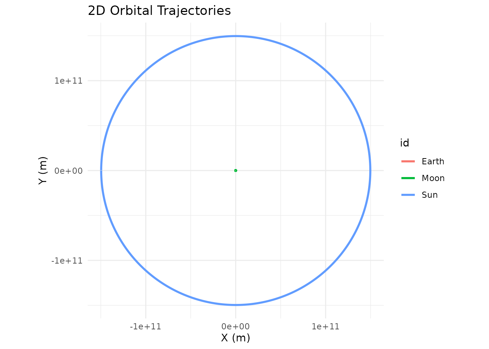
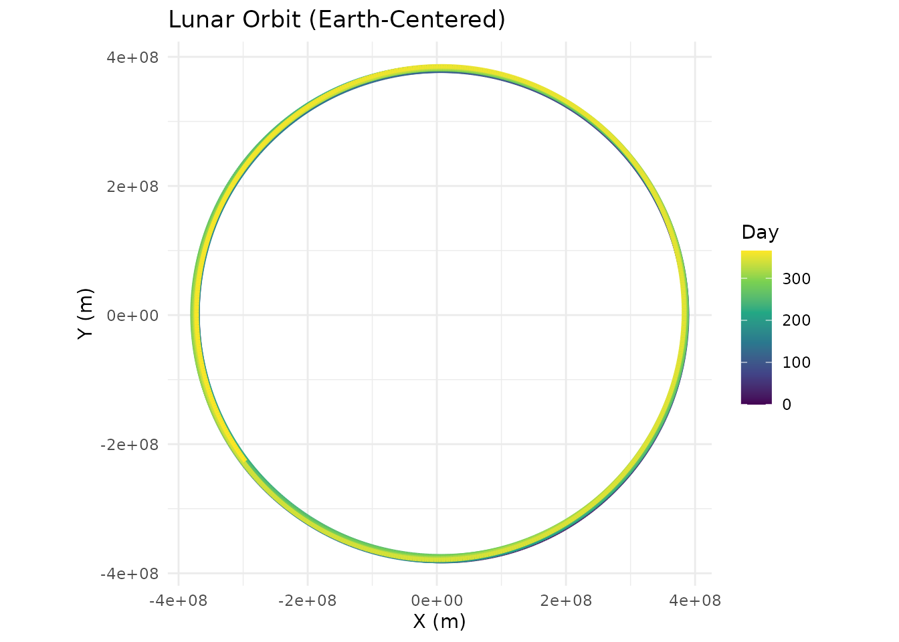
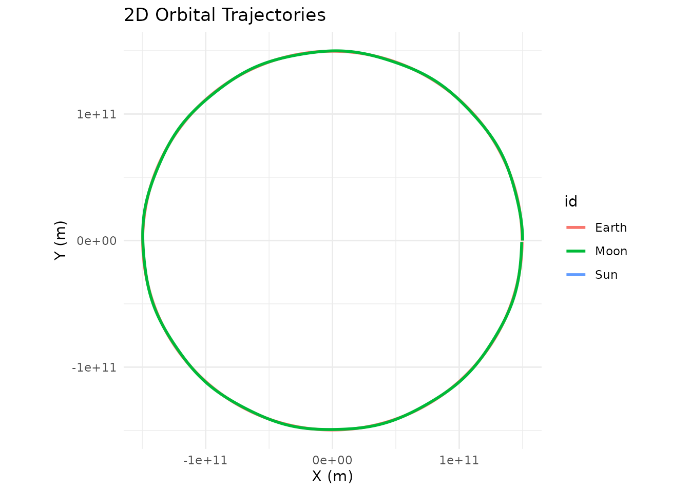
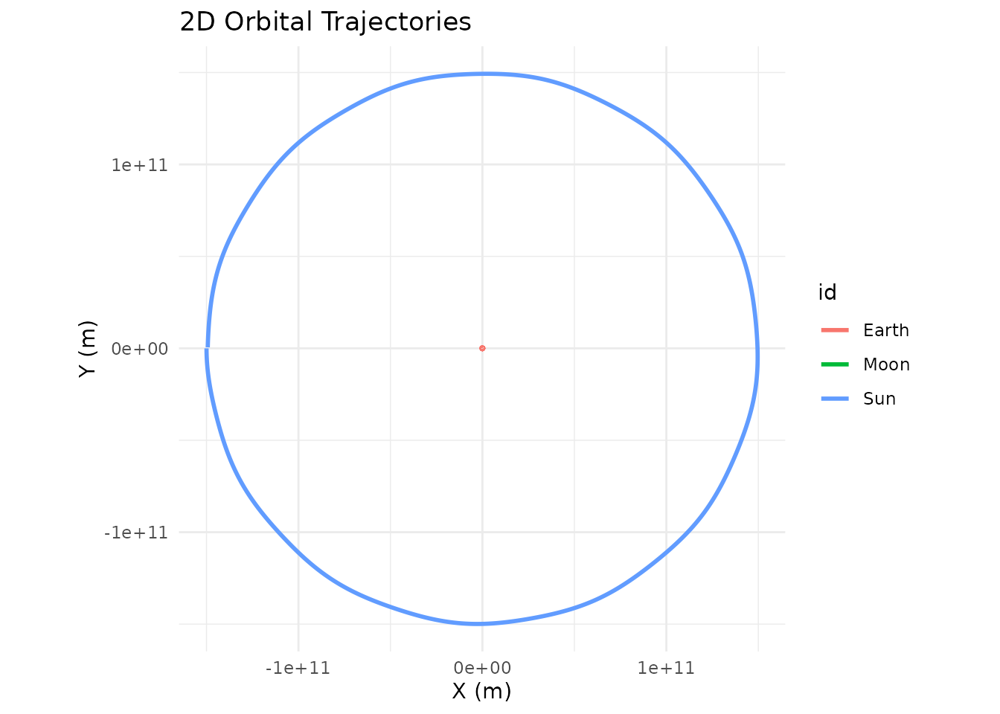
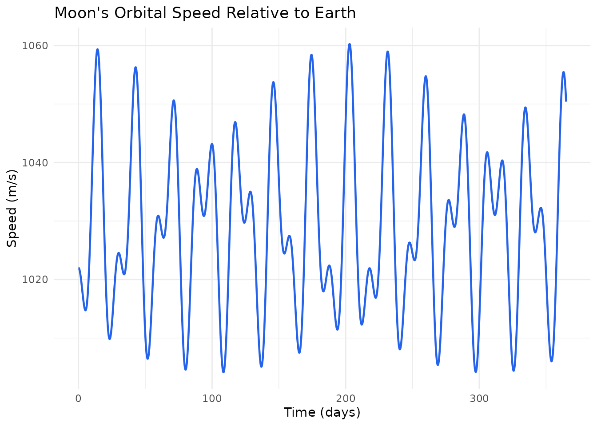
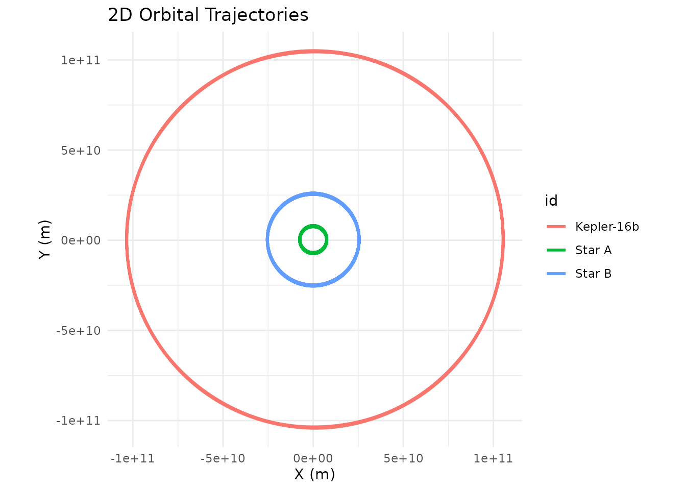
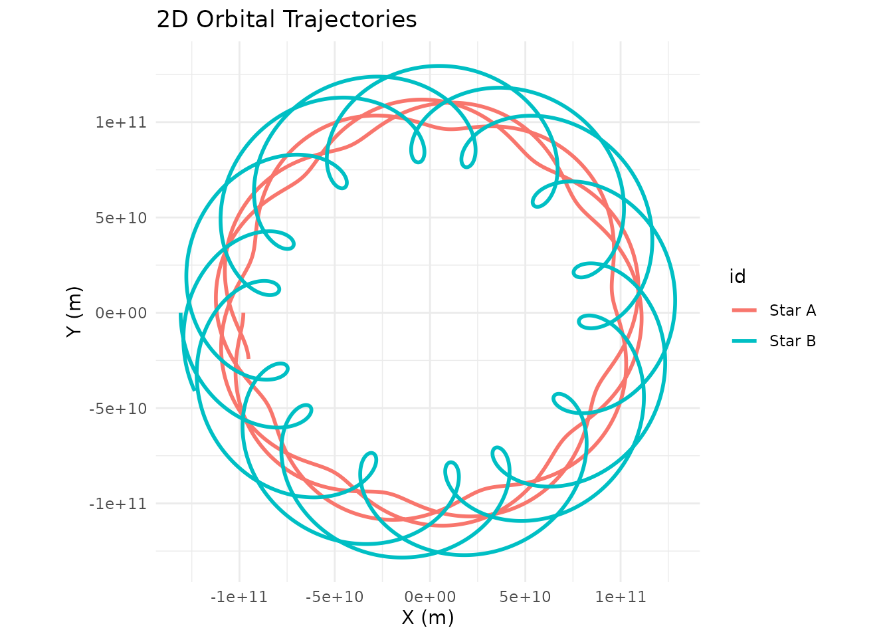
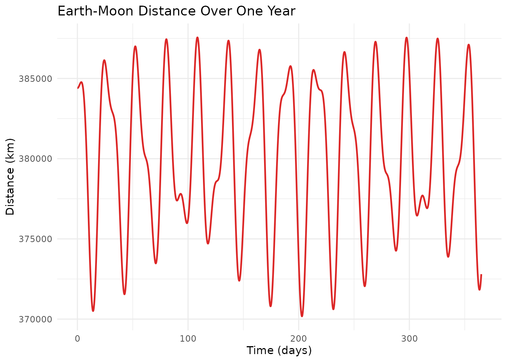

# Reference Frames

``` r
library(orbitr)
```

## The Problem of Scale

Every N-body simulation has to pick an origin — some point that sits at
(0, 0, 0). By default, `orbitr` uses the coordinate system you set up:
whatever body you placed at the origin stays there (at least initially),
and everything else is measured relative to that point. This is your
**reference frame**.

The trouble is that the “natural” reference frame for building a
simulation isn’t always the best one for understanding the results.
Consider the Sun-Earth-Moon system. The obvious way to set it up is
heliocentric (Sun at the origin):

``` r
sim <- create_system() |>
  add_body("Sun",   mass = mass_sun) |>
  add_body("Earth", mass = mass_earth, x = distance_earth_sun, vy = speed_earth) |>
  add_body("Moon",  mass = mass_moon,
           x = distance_earth_sun + distance_earth_moon,
           vy = speed_earth + speed_moon) |>
  simulate_system(time_step = 3600, duration = 86400 * 365)

sim |> plot_orbits()
```


At this scale the Earth-Moon distance (~384,000 km) is a rounding error
compared to the Earth-Sun distance (~150 million km). The Moon’s
trajectory overlaps Earth’s completely, and the Sun barely moves (its
tiny wobble around the barycenter is invisible at this zoom level), so
[`plot_orbits()`](https://drosenman.github.io/orbitr/reference/plot_orbits.md)
only shows what looks like a single circular track. The physics is fine;
the perspective is wrong.

## Shifting the Reference Frame

[`shift_reference_frame()`](https://drosenman.github.io/orbitr/reference/shift_reference_frame.md)
fixes this by applying a Galilean coordinate transformation. At every
time step, it subtracts the position and velocity of a chosen body from
all other bodies:

$$\overset{\rightarrow}{r}\prime_{i}(t) = {\overset{\rightarrow}{r}}_{i}(t) - {\overset{\rightarrow}{r}}_{\text{center}}(t)\qquad\overset{\rightarrow}{v}\prime_{i}(t) = {\overset{\rightarrow}{v}}_{i}(t) - {\overset{\rightarrow}{v}}_{\text{center}}(t)$$

The chosen body ends up fixed at the origin, and every other body’s
trajectory shows its motion *relative to that body*. No physics changes
— same forces, same accelerations — you’re just moving the camera.

``` r
sim |>
  shift_reference_frame("Earth") |>
  plot_orbits()
```



Now Earth sits at the center, the Moon traces its familiar near-circular
orbit, and the Sun sweeps a wide arc in the background. This is the
geocentric view — the same system, seen from a different place.

## How It Works

The function signature is:

``` r
shift_reference_frame(sim_data, center_id, keep_center = TRUE)
```

| Parameter     | Type        | Default | Description                                                                                        |
|---------------|-------------|---------|----------------------------------------------------------------------------------------------------|
| `sim_data`    | `tibble`    | —       | Output from [`simulate_system()`](https://drosenman.github.io/orbitr/reference/simulate_system.md) |
| `center_id`   | `character` | —       | ID of the body to place at (0, 0, 0)                                                               |
| `keep_center` | `logical`   | `TRUE`  | Keep the center body in the output?                                                                |

The transformation operates on all six phase-space coordinates (`x`,
`y`, `z`, `vx`, `vy`, `vz`) simultaneously. At each time step, the
function captures the center body’s exact state and subtracts it from
every body in the system. The result is a tibble with the same structure
as the input — it slots right back into the pipe.

## Keeping vs. Removing the Center Body

By default, `keep_center = TRUE` leaves the center body in the output.
Its coordinates will all be zero at every time step, so it appears as a
stationary dot at the origin. This is useful when you want to see where
the “camera” is.

Set `keep_center = FALSE` to drop the center body entirely. This is the
better choice when you’re feeding the shifted data into a custom
visualization or analysis pipeline and don’t need a point stuck at zero:

``` r
library(ggplot2)

sim |>
  shift_reference_frame("Earth", keep_center = FALSE) |>
  dplyr::filter(id == "Moon") |>
  ggplot(aes(x = x, y = y, color = time / 86400)) +
  geom_path(linewidth = 1.2) +
  scale_color_viridis_c(name = "Day") +
  coord_equal() +
  labs(title = "Lunar Orbit (Earth-Centered)", x = "X (m)", y = "Y (m)") +
  theme_minimal()
```



## Multiple Perspectives on the Same Data

Since
[`shift_reference_frame()`](https://drosenman.github.io/orbitr/reference/shift_reference_frame.md)
doesn’t modify the underlying physics — it just translates coordinates —
you can call it multiple times on the same simulation to explore
different viewpoints. There’s no need to re-run
[`simulate_system()`](https://drosenman.github.io/orbitr/reference/simulate_system.md).

``` r
# Same simulation, three different perspectives

# 1. From the Sun (original frame, but explicit)
sim |>
  shift_reference_frame("Sun") |>
  plot_orbits()
```



``` r
# 2. From the Earth
sim |>
  shift_reference_frame("Earth") |>
  plot_orbits()
```


``` r
# 3. From the Moon
sim |>
  shift_reference_frame("Moon") |>
  plot_orbits()
```



The Moon-centered (selenocentric) view is particularly interesting: from
the Moon’s perspective, the Earth appears to orbit *it* in a small
circle, while the Sun sweeps a much larger arc. This is of course just a
matter of perspective — the physics doesn’t care which body you call the
center.

## Analyzing Relative Velocities

The velocity transformation is just as useful as the position
transformation. After shifting to Earth’s frame, the velocity columns
(`vx`, `vy`, `vz`) give each body’s velocity *relative to Earth*. You
can use this to study how the Moon’s orbital speed varies over time:

``` r
library(ggplot2)

sim |>
  shift_reference_frame("Earth", keep_center = FALSE) |>
  dplyr::filter(id == "Moon") |>
  dplyr::mutate(speed = sqrt(vx^2 + vy^2 + vz^2)) |>
  ggplot(aes(x = time / 86400, y = speed)) +
  geom_line(color = "#2563eb", linewidth = 0.8) +
  labs(title = "Moon's Orbital Speed Relative to Earth",
       x = "Time (days)", y = "Speed (m/s)") +
  theme_minimal()
```



The oscillation reflects the Moon’s slightly elliptical orbit — it
speeds up at perigee (closest approach) and slows down at apogee
(farthest point), exactly as Kepler’s second law predicts.

## A Binary Star System from the Planet’s View

Reference frame shifts aren’t limited to the most massive body. You can
center on any body in the system. Here’s Kepler-16b — a real
circumbinary planet — looking back at its two parent stars:

``` r
G <- 6.6743e-11
AU <- distance_earth_sun

m_A <- 0.68 * mass_sun
m_B <- 0.20 * mass_sun
m_planet <- 0.333 * mass_jupiter

a_bin <- 0.22 * AU
r_A <- a_bin * m_B / (m_A + m_B)
r_B <- a_bin * m_A / (m_A + m_B)
v_A <- sqrt(G * m_B^2 / ((m_A + m_B) * a_bin))
v_B <- sqrt(G * m_A^2 / ((m_A + m_B) * a_bin))

r_planet <- 0.7048 * AU
v_planet <- sqrt(G * (m_A + m_B) / r_planet)

kepler16 <- create_system() |>
  add_body("Star A", mass = m_A, x = r_A, vy = v_A) |>
  add_body("Star B", mass = m_B, x = -r_B, vy = -v_B) |>
  add_body("Kepler-16b", mass = m_planet, x = r_planet, vy = v_planet) |>
  simulate_system(time_step = 3600, duration = 86400 * 228.8 * 3)
```

From the default (barycentric) frame, you see the planet’s wide orbit
and the stars’ tight inner dance:

``` r
kepler16 |> plot_orbits()
```



Now shift to the planet’s perspective:

``` r
kepler16 |>
  shift_reference_frame("Kepler-16b", keep_center = FALSE) |>
  plot_orbits()
```



From Kepler-16b, both stars trace looping spirograph-like patterns — a
combination of the binary’s mutual orbit and the planet’s own revolution
around the pair. This is what a double sunset looks like when you map it
over time: two stars that dance around each other while slowly circling
the sky.

## Practical Tips

**Don’t re-simulate.**
[`shift_reference_frame()`](https://drosenman.github.io/orbitr/reference/shift_reference_frame.md)
is a pure coordinate transformation on the output tibble. It’s fast and
doesn’t require re-running the physics. Store the simulation result once
and shift it as many times as you need.

**Use `keep_center = FALSE` for custom plots.** When piping into
`ggplot2` or `plotly`, the center body sitting at (0, 0) with zero
velocity can clutter your visualization or skew axis ranges. Dropping it
keeps your plots clean.

**Chain with `dplyr`.** The output is a standard tibble, so you can
filter, mutate, and summarize after shifting. For instance, compute the
distance between two bodies over time, or track how relative velocity
evolves:

``` r
# Distance between Earth and Moon over time
sim |>
  shift_reference_frame("Earth", keep_center = FALSE) |>
  dplyr::filter(id == "Moon") |>
  dplyr::mutate(distance_km = sqrt(x^2 + y^2 + z^2) / 1000) |>
  ggplot(aes(x = time / 86400, y = distance_km)) +
  geom_line(color = "#dc2626", linewidth = 0.8) +
  labs(title = "Earth-Moon Distance Over One Year",
       x = "Time (days)", y = "Distance (km)") +
  theme_minimal()
```



**The frame doesn’t affect the physics.** Shifting the reference frame
is a post-processing step. The gravitational forces, accelerations, and
numerical integration all happened in the original coordinate system.
You’re just choosing where to stand when you look at the results.
