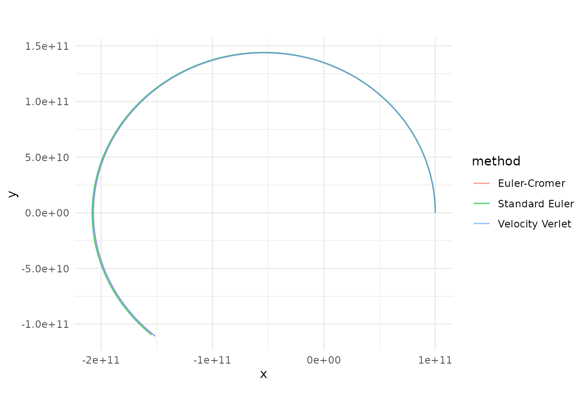

# The Physics

## Gravitational Acceleration

Every body in the system attracts every other body according to Newton’s
Law of Universal Gravitation. For body $j$, the net acceleration due to
all other bodies $k$ is:

$${\overset{\rightarrow}{a}}_{j} = \sum\limits_{k \neq j}\frac{G\, m_{k}}{r_{jk}^{2}}\,{\widehat{r}}_{jk}$$

where
$r_{jk} = |{\overset{\rightarrow}{r}}_{k} - {\overset{\rightarrow}{r}}_{j}|$
is the distance between the two bodies and ${\widehat{r}}_{jk}$ is the
unit vector pointing from $j$ toward $k$.

## Why Initial Velocity Matters

Gravity alone will pull every body straight toward every other body.
What *prevents* them from colliding is their initial velocity — the
sideways motion that turns a free-fall into a curved orbit. This is the
same reason the Moon doesn’t crash into the Earth: it’s falling toward
us constantly, but it’s also moving sideways fast enough that it keeps
missing.

When you call [`add_body()`](https://orbit-r.com/reference/add_body.md),
the `vx`, `vy`, `vz` parameters set this initial velocity. The balance
between speed and distance determines the shape of the orbit. At a given
distance $r$ from a central mass $M$, the **circular orbit velocity**
is:

$$v_{\text{circ}} = \sqrt{\frac{G\, M}{r}}$$

If the body’s speed exactly matches this, it traces a perfect circle.
Faster and the orbit stretches into an ellipse (or escapes entirely if
$v \geq v_{\text{circ}}\sqrt{2}$). Slower and the orbit drops into a
tighter ellipse that dips closer to the central body. With zero
velocity, the body falls straight in — no orbit at all.

## Gravitational Softening

When two bodies pass very close, $\left. r\rightarrow 0 \right.$ and the
acceleration diverges toward infinity. This is a well-known numerical
problem in N-body codes. `orbitr` offers an optional **softening
length** $\varepsilon$ that regularizes the potential:

$$r_{\text{soft}} = \sqrt{r^{2} + \varepsilon^{2}}$$

With softening enabled, close encounters produce large but finite forces
instead of blowing up to `NaN`. Set `softening = 0` (the default) for
exact Newtonian gravity, or try something like `softening = 1e4` (10 km)
for dense systems.

## Numerical Integration Methods

[`simulate_system()`](https://orbit-r.com/reference/simulate_system.md)
offers three methods for stepping the system forward through time. All
operate in 3D Cartesian coordinates.

### 1. Velocity Verlet (default, `method = "verlet"`)

A second-order symplectic integrator. It conserves energy over long
timescales, making it the gold standard for orbital mechanics. Orbits
stay closed and stable indefinitely.

$${\overset{\rightarrow}{x}}_{t + \Delta t} = {\overset{\rightarrow}{x}}_{t} + {\overset{\rightarrow}{v}}_{t}\,\Delta t + \frac{1}{2}{\overset{\rightarrow}{a}}_{t}\,\Delta t^{2}$$

$${\overset{\rightarrow}{v}}_{t + \Delta t} = {\overset{\rightarrow}{v}}_{t} + \frac{1}{2}\left( {\overset{\rightarrow}{a}}_{t} + {\overset{\rightarrow}{a}}_{t + \Delta t} \right)\Delta t$$

The position is advanced first, then the acceleration is recalculated at
the new position, and finally the velocity is updated using the average
of the old and new accelerations. This requires **two** acceleration
evaluations per step (the main cost), but the payoff in stability is
enormous.

### 2. Euler-Cromer (`method = "euler_cromer"`)

A first-order symplectic method. It updates velocity first, then uses
the *new* velocity to update position. This small reordering prevents
the systematic energy drift that plagues standard Euler:

$${\overset{\rightarrow}{v}}_{t + \Delta t} = {\overset{\rightarrow}{v}}_{t} + {\overset{\rightarrow}{a}}_{t}\,\Delta t$$

$${\overset{\rightarrow}{x}}_{t + \Delta t} = {\overset{\rightarrow}{x}}_{t} + {\overset{\rightarrow}{v}}_{t + \Delta t}\,\Delta t$$

Faster than Verlet (one acceleration evaluation per step) but less
accurate. Good for quick previews.

### 3. Standard Euler (`method = "euler"`)

The classical textbook method. Position and velocity are both updated
using values from the *current* time step:

$${\overset{\rightarrow}{x}}_{t + \Delta t} = {\overset{\rightarrow}{x}}_{t} + {\overset{\rightarrow}{v}}_{t}\,\Delta t$$

$${\overset{\rightarrow}{v}}_{t + \Delta t} = {\overset{\rightarrow}{v}}_{t} + {\overset{\rightarrow}{a}}_{t}\,\Delta t$$

This artificially pumps energy into the system, causing orbits to spiral
outward over time. Included primarily for educational comparison — use
Verlet for real work.

### Comparing the Three Methods

``` r
library(orbitr)
library(dplyr)
#> 
#> Attaching package: 'dplyr'
#> The following objects are masked from 'package:stats':
#> 
#>     filter, lag
#> The following objects are masked from 'package:base':
#> 
#>     intersect, setdiff, setequal, union

system <- create_system() |>
  add_body("Star", mass = 1e30) |>
  add_body("Planet", mass = 1e24, x = 1e11, vy = 30000)

verlet <- simulate_system(system, time_step = 3600, duration = 86400 * 365, method = "verlet") |>
  mutate(method = "Velocity Verlet")

euler_cromer <- simulate_system(system, time_step = 3600, duration = 86400 * 365, method = "euler_cromer") |>
  mutate(method = "Euler-Cromer")

euler <- simulate_system(system, time_step = 3600, duration = 86400 * 365, method = "euler") |>
  mutate(method = "Standard Euler")

bind_rows(verlet, euler_cromer, euler) |>
  filter(id == "Planet") |>
  ggplot2::ggplot(ggplot2::aes(x = x, y = y, color = method)) +
  ggplot2::geom_path(alpha = 0.7) +
  ggplot2::coord_equal() +
  ggplot2::theme_minimal()
```



Verlet traces a clean closed ellipse, Euler-Cromer stays close but
drifts slightly, and standard Euler spirals outward as it pumps energy
into the orbit.

## The C++ Engine

The inner acceleration loop is the computational bottleneck of any
N-body simulation. `orbitr` ships a compiled C++ kernel (via `Rcpp`)
that computes the $O\left( n^{2} \right)$ pairwise interactions in a
tight nested loop. When the package is installed from source with a
working C++ toolchain,
[`simulate_system()`](https://orbit-r.com/reference/simulate_system.md)
automatically dispatches to this engine. If the compiled code isn’t
available, it falls back to a vectorized R implementation that uses
matrix outer products — still fast, but the C++ path is significantly
faster for systems with many bodies.

You can control this with the `use_cpp` argument:

``` r
# Force the pure-R engine (useful for debugging or benchmarking)
simulate_system(system, use_cpp = FALSE)
```
