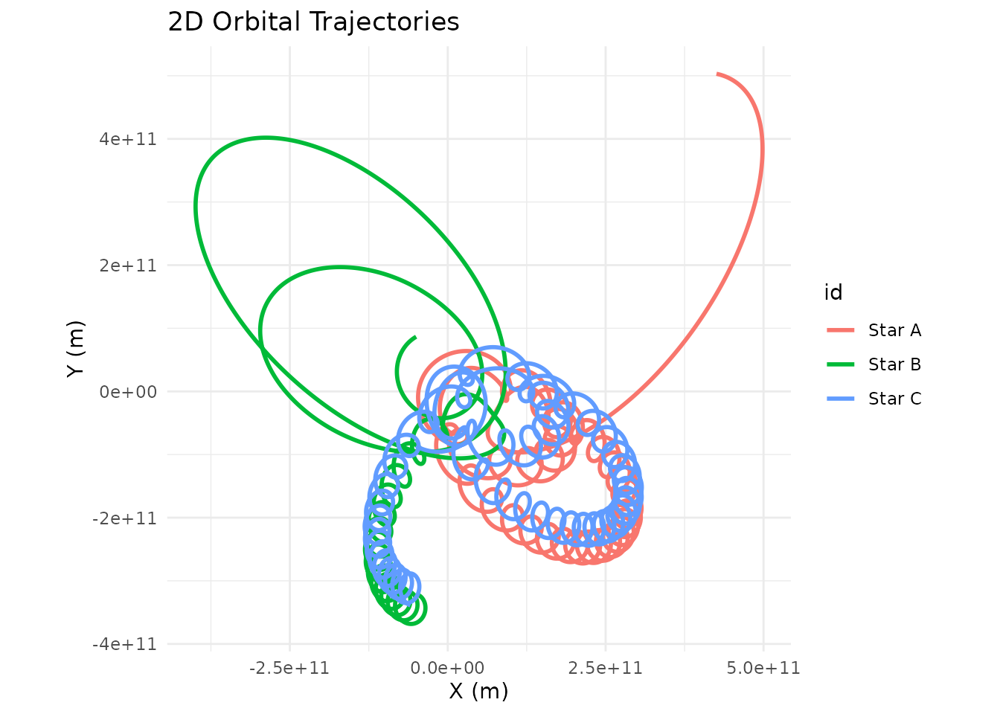

# Unstable Orbits and the Three-Body Problem

``` r
library(orbitr)
```

If you start plugging in random masses and velocities, you’ll quickly
discover that most configurations are wildly unstable. This isn’t a bug
— it’s physics. Stable orbits are the exception, not the rule.

In a two-body system, stability is relatively easy to achieve: give the
smaller body the right velocity at the right distance and it traces a
clean ellipse forever. But the moment you add a third body, things get
chaotic. The three-body problem has no general closed-form solution —
small differences in initial conditions lead to dramatically different
outcomes, including bodies being flung out of the system entirely.

## A Chaotic Triple-Star System

Here’s an example: three equal-mass stars arranged in a triangle with
slightly asymmetric velocities. It starts off looking like an
interesting dance, but the asymmetry compounds and eventually one or
more stars get ejected:

``` r
create_system() |>
  add_body("Star A", mass = 1e30, x = 1e11, y = 0, vx = 0, vy = 15000) |>
  add_body("Star B", mass = 1e30, x = -5e10, y = 8.66e10, vx = -12990, vy = -7500) |>
  add_body("Star C", mass = 1e30, x = -5e10, y = -8.66e10, vx = 14000, vy = -8000) |>
  simulate_system(time_step = 3600, duration = 86400 * 365 * 10) |>
  plot_orbits()
```



This is actually what happens in real stellar dynamics — close
three-body encounters in star clusters frequently eject one star at high
velocity while the remaining two settle into a tighter binary. The
process is called gravitational slingshot ejection.

## Troubleshooting Unstable Simulations

If your simulations are producing messy, diverging trajectories, here
are a few things to check before assuming something is wrong:

**Velocity too high or too low.** At a given distance $r$ from a central
mass $M$, the circular orbit speed is $v = \sqrt{GM/r}$. Deviating
significantly from this produces eccentric orbits or escape
trajectories.

**Bodies too close together.** Close encounters produce extreme
accelerations that can blow up numerically. Try increasing `softening`
or using a smaller `time_step`.

**Three or more bodies.** Chaos is the natural state of N-body systems.
The stable examples in the documentation are carefully tuned — don’t
expect random configurations to behave.

**Time step too large.** If bodies move a significant fraction of their
orbital radius in a single step, the integrator can’t track the orbit
accurately. Try halving `time_step` and see if the result changes.

The built-in constants and examples in `orbitr` are designed to give you
stable starting points. From there you can tweak parameters and watch
how the system responds — that’s where the real intuition for orbital
mechanics comes from.
